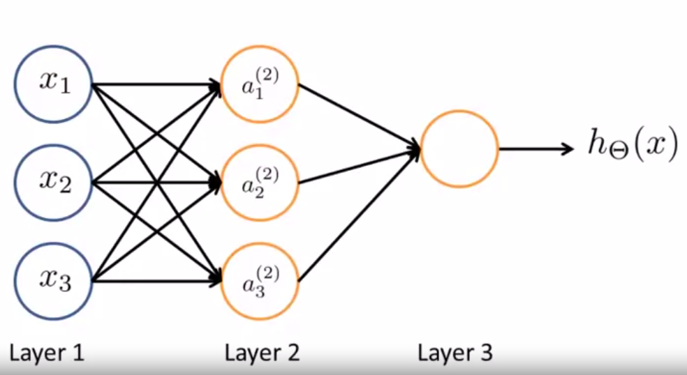

# Neural Networks: Representation

# 1. Motivation
## 1.1 Are not Linear regression and Logistic Regression enough ?
The Mechanisms discussed previously can be extended to build more complex models such as polynomial models. Yet, let's consider the following computational issue. In *Computer Vision*, one of the areas tightly related to ML, an image is internally represented as a $m * m$ matrix of color intensity pixels. for orginially, $n$ features, a quadratic model would require $C^2_n = \frac{n(n-1)}{2}$, $O(n^2)$ new features as combincations of the original ones. A regular image would have $100 * 100 = 10^4$ pixels which means, a quadractic model would require approximately $ 5 * 10^7$ features which is computationally extremely expensive. Let alone a polynomial of degree $k$ would require $C^k_n \approx n^k$ features.

## 2. Hypothesis Representation
### 2.1 Brain Neuron
Each neuron has a basic anatomical structure represented as follows:

The ***dendrites*** are generally referred to as ***input wires***. The axon is referred to as ***ouput wire*** and the ***nucleus*** is computational unit that transfers the input to output.

### 2.2 Artificial Neural Network Representation
Each Aritificial neural network constitutes of one ***input layer***, one ***output layer*** and an optional number of layers in between. Those are referred to as ***hidden layers***.

Let's consider a simplistic example of a Neural Network with only 3 layers:

This model can be expressed by this system of equations:

$\begin{aligned}
a_1^{(2)} = g(\Theta_{10}^1*x_0 + \Theta_{11}^1*x_1 + \Theta_{12}^1*x_2 + \Theta_{13}^1*x_3)\\
a_2^{(2)} = g(\Theta_{20}^1*x_0 + \Theta_{21}^1*x_1 + \Theta_{22}^1*x_2 + \Theta_{23}^1*x_3)\\
a_3^{(2)} = g(\Theta_{30}^1*x_0 + \Theta_{31}^1*x_1 + \Theta_{32}^1*x_2 + \Theta_{33}^1*x_3)\\
h_{\Theta} = a_1^3 = g(\Theta_{10}^2*a_0^{(2)} + \Theta_{11}^2*a_1^{(2)} + \Theta_{12}^2*a_2^{(2)} + \Theta_{13}^2*a_3^{(2)}) 
\end{aligned}$ 
The system above can be rewritten in matrix form as follows:
$\begin{aligned}
\begin{bmatrix}
a_1^{(2)}\\
a_2^{(2)} \\
a_3^{(2)}
\end{bmatrix}
=  g (
\begin{bmatrix}
\Theta_{10}^{(1)} && \Theta_{11}^{(1)} && \Theta_{12}^{(1)} && \Theta_{13}^{(1)} \\
\Theta_{20}^{(1)} && \Theta_{21}^{(1)} && \Theta_{22}^{(1)} && \Theta_{23}^{(1)} \\
\Theta_{30}^{(1)} && \Theta_{31}^{(1)} && \Theta_{32}^{(1)} && \Theta_{33}^{(1)}
\end{bmatrix}
*
\begin{bmatrix}
x_0 \\
x_1 \\
x_2 \\
x_3
\end{bmatrix}
)
\end{aligned}$
More generally
$
S_{i+1} = g(\Theta^i * S_{i}) 
$
where
* g is the sigmoid function
* $S_i$: the vector of values generated in the $i$-th layer with length $s_{i}$ 
* $S_{i+1}$: vector of values generated in the $(i+1)$-th layer with length $s_{i + 1}$ 
* $\Theta^{(i)}$ is the matrix mapping the input of the $i$-th layer to the $(i+1)$-th one.
* $\Theta^{(i)}$ is of dimensions $s_{i + 1} * (s_{i} + 1)$  
* a value $S^i_0$ is added to each layer and is denoted as the ***bias unit*** and generally equal to $1$.
