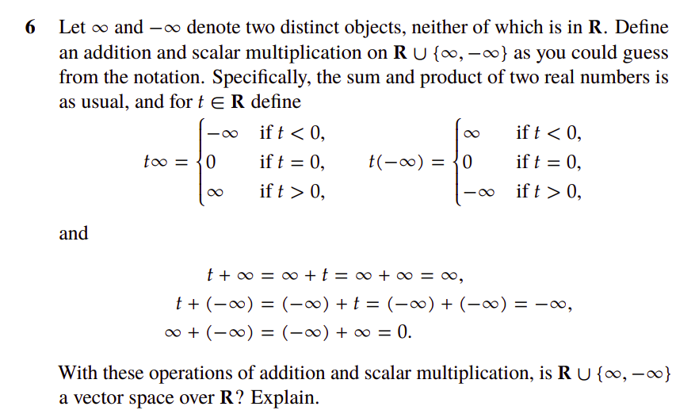
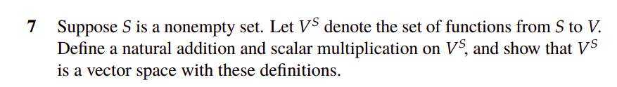

# Overview

This is my attempt to solve the problems of the first chapter of Linear Algebra Done Right by 

Any proof on vector spaces will have to start from these axioms

## Notes

Additional important results to keep in mind:

- uniqueness of the additive inverse: for a given vector $v$, if there are 2 vectors $a, b$ such that $a + v = b + v = 0$, then $a = b = (-v)$

- for $0 \in F$, $$\forall v \in V, \implies 0 \cdot v = 0$$

- for $0 \in V$
    $$\forall a \in F \implies a \cdot v = 0$$

## 1.B: Vector Space defintion

### Problem 1

- keep in mind that uniquess of the additive inverse

$$
\begin{align*}
v + (-v) &= 0 && \text{by definition of the additive inverse for $v$} \\
(-v) + -(-v) &= 0 && \text{by definition of the additive inverse for $-v$} \\
\implies v + (-v) &= -(-v) + (-v) = 0

\end{align*}
$$

using the uniqueness of the additive inverse $$-(-v) = v$$

### Problem 2

2   Suppose a ∈ F, v ∈ V and av = 0.  Show that a = 0 or v = 0.  

- Main idea: if $a \neq 0, a \in F$, then $\exists ~ a^{-1} \in F$ such that $a \cdot a^{-1} = 1$

Let's assume that $a \neq 0$

$$
\begin{align*}
a \cdot v &= 0 \\
a^{-1} \cdot (a \cdot v) &= a^{-1} \cdot 0 = 0 \\
(a^{-1} \cdot a) \cdot v &= 0 ~~ \text{by multiplicative associativity} \\
1 \cdot v = v &= 0
\end{align*}
$$

and hence the result

### Problem 3

Given $v,w ∈ V$, explain why there exists a unique x ∈ V such that $v + 3x = w.$

Step 1. existence

$x = 3^{-1} \cdot (w + (-v))$ is a solution

$$
\begin{align*}
3 \cdot x &= 3 \cdot 3^{-1} \cdot (w + (-v)) \\ 
\implies 3 \cdot x &= 1 \cdot (w + (-v)) \\
\implies 3 \cdot x &= w + (-v) \\
\implies v + 3 \cdot x &= w
\end{align*}
$$

Let's suppose that $x_1$ satisfies the equation, let's prove that $x_1 = x$ 

$$
\begin{align*}
\implies v + 3 \cdot x_1 &= w \\
\implies 3 \cdot x_1 &= w + (-v) \\
\implies 3^{-1} \cdot 3 \cdot x_1 &= 3^{-1} \cdot (w + (-v)) \\
\implies x_1 &= 3^{-1} \cdot (w + (-v)) \\
\end{align*}
$$

$3^{-1} \cdot (w + (-v))$ is indeed unique since $-v$ is unique for a given $v$

### Problem 4

The empty set is not a vector space.  It fails exactly one axiom— which? 

The additive identity requires the existence of an element $0 \in V$, since the empty set has no elements, it cannot contain the additive identity. Therefore, it is not a vector space.

### Problem 5

Show that the additive-inverse axiom can be replaced by

$$   0 v = 0 \text{for every} ~~ v ∈ V.  $$

The proof is 2 directions: 

1. if a set of vectors satisfy the axioms of a vector space, then the condition above is satisfied
2. if a set of vectors satisfy the axioms of a vector space (except the additive-inverse axiom) + this condition, then the additive inverse axiom is satisfied. 

- Dir 1:

$$
\begin{align*}
0 \cdot v &= (0 + 0) \cdot v = 0 \cdot v + 0 \cdot v \\
- (0 \cdot v) + 0 \cdot v &= - (0 \cdot v) + 0 \cdot v + 0 \cdot v \\
0 &= 0 \cdot v && \text{by the additive inverse axiom}
\end{align*}
$$

- Dir 2: 

Let's suppose that $0 \cdot v = 0 ~~ \forall v \in V$, we need to prove the existence of an additive inverse. 

My approach relies on the following assumptions of a field 

- existence of an multiplicative identity $1 \in F, 1 \cdot v = v, \forall v \in V$

- existence of an additive inverse for every scalar $(a +(-a) = 0), \forall a \in F$ 

$$
\begin{align*}
0 \cdot v &= 0 && \text{given} \\
\implies (1 + (-1)) \cdot v & = 0 && \text{using the assumptions above} \\
\implies 1 \cdot v + (-1)\cdot v & = 0 \\
\implies v + (-1)\cdot v & = 0 && \text{using the multiplicative identity} 
\end{align*}
$$

which means that for any vector $v \in F$, there exists a vector $(-1) \cdot v \in F$ such $v +  (-1) \cdot v = 0$

### Problem 6

We need to prove that $S = R \cup (\infty, \infty)$ is a vector space over $R$.

Let's start with the axioms of a vector space: (I am trying to chunk the axioms)

1. pure vector space axioms: 
    
    - commutativity of addition

    $$
    \begin{align*}
    v + w &= w + v && \text{for any $v, w \in \mathbb{R}$} \\
    (\infty + v) &= (v + \infty) = \infty && \text{for any $v\in \mathbb{R}$} \\
    (-\infty + v) &= (v + (-\infty)) = -\infty && \text{for any $v\in \mathbb{R}$} \\
    (\infty + (-\infty)) &= ((-\infty) + \infty) = 0 &&\text{given} \\
    (\infty + \infty) &= (\infty + \infty) = \infty &&\text{given} \\
    (-\infty + (-\infty)) &= (-\infty + (-\infty)) = -\infty &&\text{given} \\
    \end{align*}
    $$

    - associativity of addition: tedious but straightforward (using the number of infinity values in the expression)

    -  existence of an additive identity
        
    $$
    \begin{align*}
    0 + v &= v && \text{for any $v \in \mathbb{R}$} \\ 
    0 + (\infty) &= (\infty) && \text{given} \\
    0 + (-\infty) &= (-\infty) && \text{given} \\
    \implies 0 + v &= v \text{ for any } v \in S
    \end{align*}
    $$

    ==> additive identity is satisfied

    -  existence of an additive inverse

    $$
    \begin{align*}
    v + (-v) &= 0 && \text{for any $v \in \mathbb{R}$} \\
    (\infty + (-\infty)) &= 0 && \text{given} \\
    \implies & \forall v \in S, \exists -v \in S \text{ such that } v + (-v) = 0
    \end{align*}
    $$

    ==> additive inverse is satisfied
    
    
    - addition of two vectors in $S$ is a vector in $S$ 

    $$
    \begin{align*}
    v + w &= v + w && \text{for any $v, w \in \mathbb{R}$} \\
    (\infty + v) &= \infty && \text{for any $v\in \mathbb{R}$} \\
    (-\infty + v) &= -\infty && \text{for any $v\in \mathbb{R}$} \\
    (\infty + (-\infty)) &= 0 && \text{given} \\
    (\infty + (\infty)) &= \infty && \text{given} \\
    (-\infty + (-\infty)) &= (-\infty) && \text{given} \\
    \implies & x + y \in S \text{ for any } x, y \in S
    \end{align*}
    $$

    ==> addition of two vectors in $S$ is a vector in $S$ satisfied

2. scalar multiplication axioms:

    - commutativity of scalar multiplication: $(a \cdot b) \cdot v = a \cdot (b \cdot v)$

    since this property is true for real numbers, we need to prove it for $\infty$ and $-\infty$

    $$
    \begin{align*}
    a \cdot b &\neq 0 \\ 

    a \cdot b \cdot (\infty) = sign(a) \cdot (sign(b) \cdot \infty) &= (sign(a) \cdot sign(b)) \cdot \infty \\

    a \cdot b \cdot (-\infty) = sign(a) \cdot (sign(b) \cdot (-\infty)) &= (sign(a) \cdot sign(b)) \cdot (-\infty) \\

    \text{since ~~} 0 \cdot \infty = 0 \cdot (-\infty) = 0

    a \cdot b = 0 &\implies (a \cdot b) \cdot \infty = a \cdot (b \cdot \infty) = 0 \\
    \end{align*}
    $$

    - associativity of scalar multiplication

I just gave up on the rest of the axioms cause they are too tedious to verify...

### Problem 7 

- addition: 

Given 2 functions $f: S \rightarrow V$ and $g: S \rightarrow V$, define $(f + g): S \rightarrow V$ by $$(f + g)(s) = f(s) + g(s)$$

- multiplication: Let $a \in F$ and $f: S \rightarrow V$ be a function. Define $(a \cdot f): S \rightarrow V$ by $$(a \cdot f)(s) = a \cdot f(s)$$

Let's go through the axioms one by one:

1. pure vector space axioms:

    - commutativity of addition: 

        for any $s \in S$, $f(s) \in V$ and $g(s) \in V$
            
        which implies that $$(f + g)(s) = f(s) + g(s) = g(s) + f(s) = (g + f)(s)$$ 

        ==> commutativity of addition is satisfied

    - associativity of addition: 
    
        let $f_1, f_2, f_3 \in V^S$, for any $s \in S$, we have:

        $$
        \begin{align*}
        ((f_1 + f_2) + f_3)(s) &= (f_1 + f_2)(s) + f_3(s) \\
        &= f_1(s) + (f_2(s) + f_3(s)) && \text{since $f_i(s) 
        \in V$}\\
        \end{align*}
        $$

        ==> associativity of addition is satisfied

    - addition of two functions in $V^S$ is a function in $V^S$ 

    - existince of additive identity: 

        define the function $f: S \rightarrow V$ by $f(s) = 0$ for any $s \in S$ 

        for any function $g \in V^S$, we have:

        $$
        \begin{align*}
        (f + g)(s) &= f(s) + g(s) \\
        &= 0 + g(s) \\
        &= g(s) \\
        \implies & f + g = g \text{ for any } g \in V^S
        \end{align*}
        $$

        ==> existince of additive identity is satisfied

    - existince of additive inverse: 

        for a given function $g \in V^S$, define the function $f: S \rightarrow V$ by $f(s) = -g(s)$ for any $s \in S$ 

        $$ 
        \begin{align*}
        (f + g)(s) &= f(s) + g(s) \\
        &= -g(s) + g(s) \\
        &= 0 \\
        \implies & f + g = 0 \text{ for any } g \in V^S
        \end{align*}
        $$

        ==> existince of additive inverse is satisfied

2. scalar multiplication axioms:

    - multiplication of a scalar and a function in $V^S$ is a function in $V^S$  

    - the other axioms are too tedious to verify... 

