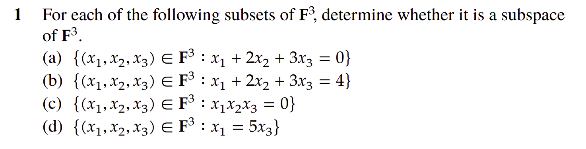

# Section 3: Subspaces

## Problem 1

- $a$ is a line in $R^3$ passing through the origin => subspace of $R^3$

- $0$ does not belong to $b$ => $b$ is not a subspace of $R^3$

- $a_1 = (1, 0, 0) \in c$ and $a_2 = (0, 1, 1) \in c$ are in $c$ => $a_1 + a_2 = (1, 1, 1) \notin c$ \implies $c$ is not a subspace.

- $0 \in d$ $\lambda \cdot x = (\lambda \cdot x_1, \lambda \cdot x_2, \lambda \cdot x_3) \in d$ for any $\lambda \in R$ => $

$x_1 = 5 \cdot x_3 \implies \lambda \cdot x_1 = 5 \cdot \lambda \cdot x_3 \notin d$ for any $\lambda \in R$ => $d$ is a subspace. 

## Problem 3

Let
$$
W=\bigl\{f:(-4,4)\longrightarrow\mathbb R\;\bigm|\;f\text{ is differentiable and }f'(-1)=3f(2)\bigr\}.
$$
We show that $W$ is a subspace of the vector space $\mathbb R^{(-4,4)}$.

1. (Zero vector)  The zero function $0$ satisfies $0'(-1)=0=3\cdot0(2)$, hence $0\in W$.
2. (Closure under addition)  If $f,g\in W$ then using linearity of the derivative
   $$(f+g)'(-1)=f'(-1)+g'(-1)=3f(2)+3g(2)=3\bigl(f(2)+g(2)\bigr)=3\,(f+g)(2),$$
   so $f+g\in W$.
3. (Closure under scalar multiplication)  For $\lambda\in\mathbb R$ and $f\in W$,
   $$(\lambda f)'(-1)=\lambda f'(-1)=3\lambda f(2)=3\,(\lambda f)(2),$$
   hence $\lambda f\in W$.

Therefore $W$ is a subspace.

## Problem 4

For $b\in\mathbb R$ define
$$
W_b=\Bigl\{f\in C[0,1]\;\Bigm|\;\int_0^1 f(t)\,dt=b\Bigr\}.
$$

We prove that $W_b$ is a subspace of $\mathbb R^{[0,1]}$ iff $b=0$.

($\Rightarrow$)  If $W_b$ is a subspace, it contains the zero function.  But
$$\int_0^1 0\,dt=0,$$

so $b$ must equal $0$.

($\Leftarrow$)  Conversely, if $b=0$ then $W_0=\bigl\{f\in C[0,1]\mid\int_0^1 f=0\bigr\}$.
Linearity of the integral gives
* $0\in W_0$,
* if $f,g\in W_0$ then $\int_0^1(f+g)=0+0=0$ so $f+g\in W_0$,
* for $\lambda\in\mathbb R$, $\int_0^1 \lambda f = \lambda\int_0^1 f = 0$, hence $\lambda f\in W_0$.

Thus $W_0$ is a subspace.  Therefore $W_b$ is a subspace precisely when $b=0$.

## Problem 5

The vector space $\mathbb C^2$ is defined over the field $\mathbb C$.  

Take the real vector $x=(1,0)\in\mathbb R^2$.  

Multiplying by the complex scalar $i$ yields $i\,x=(i,0)$, which is **not** in $\mathbb R^2$.  

Hence $\mathbb R^2$ is **not** closed under scalar multiplication by complex numbers 

and is therefore **not** a subspace of $\mathbb C^2$.

## Problem 6

(a)  In $\mathbb R$ the equation $a^3=b^3$ implies $a=b$.  Hence

$$S=\{(a,b,c)\in\mathbb R^3\mid a^3=b^3\}=\{(a,a,c)\mid a,c\in\mathbb R\}.$$
It is easy to prove that is is indeed a subspace of $\mathbb R^3$. 

(b)  Over $\mathbb C$ we may have $a^3=b^3$ with $a\neq b$ (e.g. $a=1$, $b=\omega$ where $\omega=e^{2\pi i/3}$).  Let
$$u=(1,1,0),\qquad v=(1,\omega,0).$$
Both satisfy $a^3=b^3$ and hence lie in

$$T=\{(a,b,c)\in\mathbb C^3\mid a^3=b^3\},$$

but $u+v=(2,1+\omega,0)$ has first and second components whose cubes differ, so $u+v\notin T$.  Thus 

$T$ is **not** closed under addition and is **not** a subspace of $\mathbb C^3$.

## Problem 7

The statement is **false**.  

Consider

$$U=\mathbb Z^2=\{(m,n)\mid m,n\in\mathbb Z\}\subset\mathbb R^2.$$

The set is non-empty and is closed under vector addition and additive inverses, but for the real scalar $\frac12$ and $u=(1,0)\in U$ we have $\tfrac12 u=(\tfrac12,0)\notin U$.  

Hence $U$ is **not** a subspace of $\mathbb R^2$.

## Problem 15

Let $U$ be a subspace of $V$.  Define the sum $U+U=\{u_1+u_2\mid u_1,u_2\in U\}$.  

* ($\subseteq$)  If $x\in U+U$, then $x=u_1+u_2$ with $u_i\in U$.  Because $U$ is a subspace, $u_1+u_2\in U$, so $x\in U$.
* ($\supseteq$)  For $u\in U$ we have $u=u+0$ with $0\in U$, hence $u\in U+U$.

Thus $U+U=U$.

## Problem 16

Let $V_1,V_2\le V$ and set 

$$V_1+V_2=\{v_1+v_2\mid v_1\in V_1,\,v_2\in V_2\}$$

For $x=v_1+v_2$ we also have $x=v_2+v_1\in V_2+V_1$ 

since vector addition in $V$ is commutative.  The same argument in reverse shows the opposite inclusion, hence $V_1+V_2=V_2+V_1$; addition of subspaces is commutative.

## Problem 17

For subspaces $V_1,V_2,V_3\le V$ we have

$$(V_1+V_2)+V_3=\{(v_1+v_2)+v_3\mid v_i\in V_i\} = \{v_1+(v_2+v_3)\mid v_i\in V_i\}=V_1+(V_2+V_3),$$

because vector addition in $V$ is associative.  Hence addition of subspaces is associative.

## Problem 18

The additive identity for the operation ``$+$'' on subspaces is the trivial subspace

$$V_0=\{0\},$$

because $W+V_0=\{w+0\mid w\in W\}=W$ for every subspace $W\le V$.

A subspace $W$ has an additive inverse $W'$ when $W+W'=V_0$.  This forces every $w\in W$ to satisfy $w=-w'\;(w'\in W')$, 

and since the additive inverse of a vector is unique, there should be only element in both $W$ and $W'$. 

so $w=0$; hence $W=V_0$ and similarly $W'=V_0$.  Therefore the **only** subspace possessing an additive inverse (and it is its own inverse) is $V_0$.

## Problem 19

Equality of sums need **not** imply equality of summands.  In $\mathbb R^2$ set
$$V_1=\operatorname{span}\{(1,0)\},\qquad V_2=\operatorname{span}\{(0,1)\},\qquad U=\operatorname{span}\{(1,1)\}.$$
Each is a one-dimensional subspace through the origin, and
$$V_1+U=V_2+U=\mathbb R^2,$$
while $V_1\neq V_2$.  Hence $V_1+U=V_2+U$ does **not** force $V_1=V_2$.  
