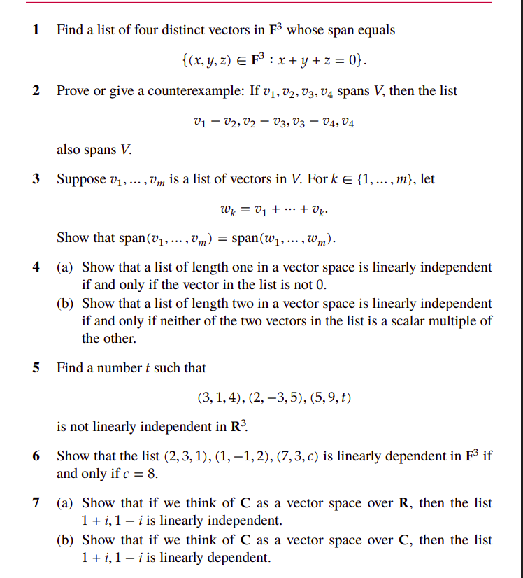
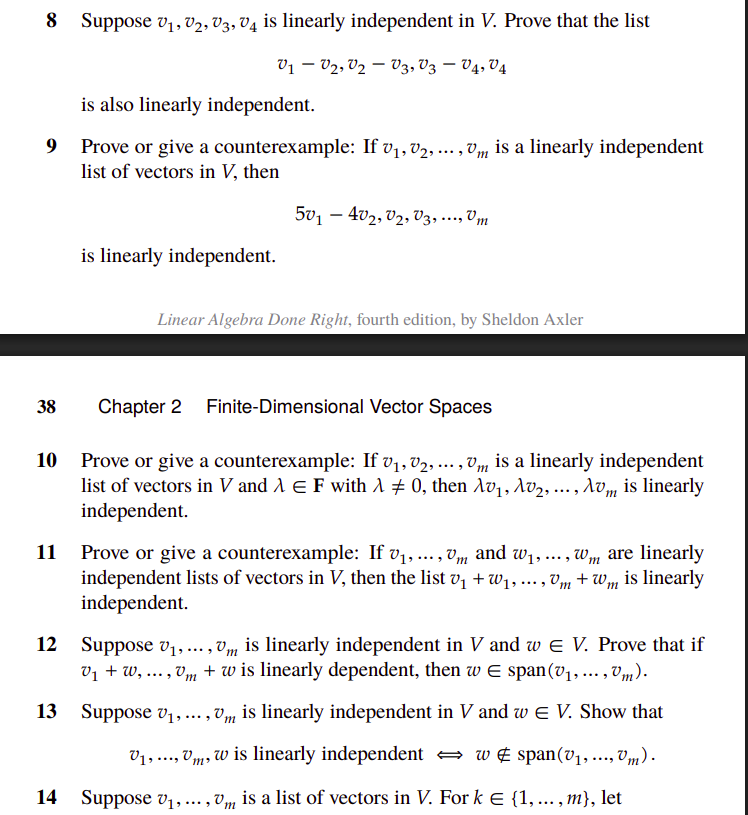

# Overview 

This is my attempt to solve problems from the 2nd chapter 1st section of the book "Linear Algebra Done Right" by Sheldon Axler. 

## Problem 1 

Just consider 4 points that belong to the line specificed by the vector space 

$(-1, 1, 0), (0, 1, -1), (1, 1, -2), (2, 1, -3)$

any linear combination of these points will also belong to the line. 

## Problem 2

The general idea here is that the set of vectors 

$$
v_1 - v_2, v_2 - v_3, v_3 - v_4, v_4
$$

is the result of a reversible linear transformation of the set of vectors 

$$
v_1, v_2, v_3, v_4
$$

Denoting 

$$
\begin{align*}
V &= 
\begin{bmatrix}
v_1  && v_2 && v_3 && v_4
\end{bmatrix} \\

\implies V^{'}  &= 
\begin{bmatrix}
v_1 - v_2  && v_2 - v3 && v_3 - v4 && v_4 
\end{bmatrix} 
= V \cdot 

\begin{bmatrix} 
1 && 0 && 0 && 0 \\
-1 && 1 && 0 && 0 \\
0 && -1 && 1 && 0 \\
0 && 0 && -1 && 1 \\
\end{bmatrix}

\end{align*}
$$

Given that $V' = V \cdot A$ where $A$ is a reversible matrix (lower triangular matrix with 1s on the diagonal so its determinant is $1 \neq 0$),  then for any vector

$$\begin{align*}
b &= V \cdot x \\
b &= V \cdot A \cdot A^{-1} \cdot x \\
b &= V' \cdot A^{-1} \cdot x \\
b &= V' \cdot y \\
\end{align*}
$$

so $V$ and $V'$ span the same vector space. 

This solution does not fit the material covered in this section. So the "correct" way would be to solve the system

$$
\begin{align*}
x &= \sum_{i=1}^{4} \alpha_i v_i \\ 
x &= a_1 \cdot (v_1 - v_2) + a_2 \cdot (v_2 - v_3) + a_3 \cdot (v_3 - v_4) + a_4 \cdot v_4 \\
\end{align*}
$$ 

The system above has a solution: 

$$
\begin{align*}
a_1 &= \alpha_1 \\
a_2 &= \alpha_2 + \alpha_1 \\
a_3 &= \alpha_3 + \alpha_2 + \alpha_1\\
a_4 &= \alpha_4 + \alpha_3 + \alpha_2 + \alpha_1\\
\end{align*}
$$

which proves the statement.

## Problem 3

This problem is similar to the previous one.

$$
\begin{align*}
V &= \begin{bmatrix}
v_1 && v_2 && .. && .. && v_n
\end{bmatrix} \\
w_k &= \sum_{i=1}^{k} v_i \\
W &= \begin{bmatrix}
w_1 && w_2 && .. && .. && w_n
\end{bmatrix} \\

W &= V \cdot 

\begin{bmatrix}
1 && 1 && 1 && .. && 1 \\
0 && 1 && 1 && .. && 1 \\
0 && 0 && 1 && .. && 1 \\
0 && 0 && 0 && .. && 1 \\
0 && 0 && 0 && 0 && 1 \\
\end{bmatrix}
\end{align*}
$$

Since $W = V \cdot A$ where $A$ is a reversible matrix, then $V$ and $W$ span the same vector space. 

Once again this solution does not fit the material covered in this section. One way to approach this problem without using matrices is to prove by "induction".

Since the statement is true for $n = 1 \implies w_1 = v_1$ and assuming that the statement is true for a given $n$, we consider 2 cases: 

whether $v_{n + 1} \in span(v_1, v_2, .., v_n)$ or not.  (I will hopefully finish this proof in the future...)

## Problem 7

the numbers $1 + i$ and $1 - i$ are linear independent over $\mathbb{R}$

$$\begin{align*}
\alpha \cdot (1 + i) + \beta \cdot (1 - i) = 0 \\
\alpha + \beta + (\alpha - \beta)i = 0 \\
\implies \alpha + \beta = 0 \text{ and } \alpha - \beta = 0 \\
\implies \alpha = 0 \text{ and } \beta = 0 \\
\end{align*}
$$

on the other hand if we consider the numbers $1 + i$ and $1 - i$ as vectors in $\mathbb{C}$ then they are linearly dependent over $\mathbb{C}$

$$\begin{align*}
i \cdot (1 + i) + 1 \cdot (1 - i) = 0 \\
i + i^2 + 1 - i = 0 \\
i - 1 + 1 - i = 0 \\
0 = 0 \\
\end{align*}
$$

<!--  -->

## Problem 8

This problem uses the same linear transformation as problem 2.

if $V$ has independent columns, which means that $V \cdot x = 0$ has only the trivial solution, then $V \cdot A \cdot x = 0$, where $A$ is a reversible matrix, has only the trivial solution. 
 
The "correct" way to solve this problem is to write the system of equations: 

$$
\begin{align*}
a_1 \cdot (v_1 - v_2) + a_2 \cdot (v_2 - v_3) + a_3 \cdot (v_3 - v_4) + a_4 \cdot v_4 = 0 \\
\alpha_1 \cdot v_1 + \alpha_2 \cdot v_2 + \alpha_3 \cdot v_3 + \alpha_4 \cdot v_4= 0 \\
\end{align*}
$$

and write $\alpha_i$ in terms of $a_i$, and solve for $\alpha_i = 0$, the result would be to have $a_i = 0$ for all $i$. 

## Problem 9

This problem is similar to problem 8. if the columns of $V$ are linearly independent, then the columns of $V \cdot A$ are also linearly independent (where $A$ is a reversible matrix).

