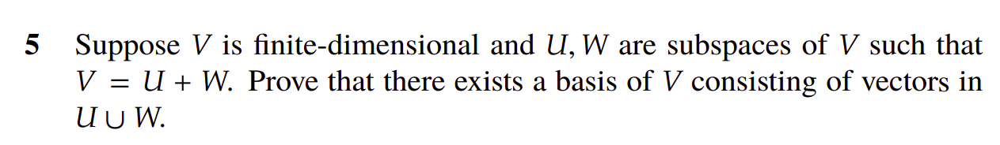
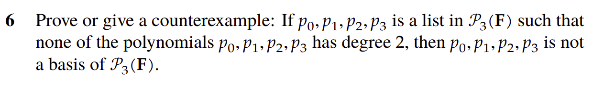
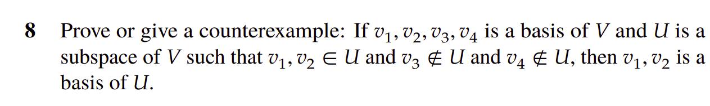
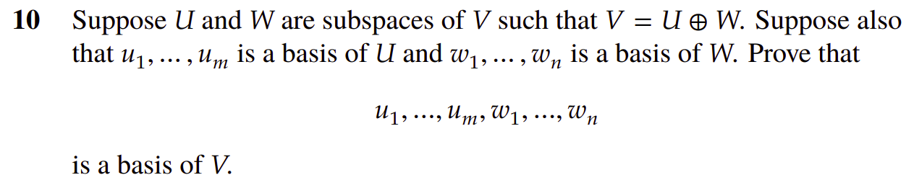

# Section 2

## Important Results

### Result 1

$$ \text{span}(v_1, v_2, .. v_n) + \text{span}(w_1, w_2, .. w_m) = \text{span}(v_1, v_2, .. v_n, w_1, w_2, .. w_m) $$ 

Let's denote $V = \text{span}(v_1, v_2, .. v_n)$,$W = \text{span}(w_1, w_2, .. w_m)$, and $U = \text{span}(v_1, v_2, .. v_n, w_1, w_2, .. w_m)$.

We need to show that $V + W = U$. This is equivalent to showing that $V + W \subseteq U$ and $U \subseteq V + W$.

1. First direction: $V + W \subseteq U$

$$
\begin{align*}
x \in V + W & \implies x = v + w \text{ for some } v \in V \text{ and } w \in W \\
& \implies x = a_1 v_1 + a_2 v_2 + \cdots + a_n v_n + b_1 w_1 + b_2 w_2 + \cdots + b_m w_m \text{ for some } a_1, a_2, \cdots, a_n, b_1, b_2, \cdots, b_m \\
& \implies x \in U \\
& \implies V + W \subseteq U \\
\end{align*}
$$

2. Second direction: $U \subseteq V + W$

$$
\begin{align*}
x \in U & \implies x = a_1 v_1 + a_2 v_2 + \cdots + a_n v_n + b_1 w_1 + b_2 w_2 + \cdots + b_m w_m \text{ for some } a_1, a_2, \cdots, a_n, b_1, b_2, \cdots, b_m \\
& \implies x = v + w \text{ for some } v \in V \text{ and } w \in W \\
& \implies x \in V + W \\
& \implies U \subseteq V + W \\
\end{align*}
$$

### Result 2

if $u_1, u_2, ... u_k$ is a basis of $U$, then for any partition of the basis into 2 sets of disjoint bases $v_1, v_2, ... v_m$ and $w_1, w_2, ... w_n$, 

Then $$U = \text{span}(v_1, v_2, ... v_m) \bigoplus \text{span}(w_1, w_2, ... w_n)$$

We know that $U = \text{span}(u_1, u_2, ... u_k) = \text{span}(v_1, v_2, ... v_m) + \text{span}(w_1, w_2, ... w_n)$ as per result 1. 

Given that $u_1, u_2, ... u_k$ is a basis of $U$, we need to prove that 

$$\text{span}(v_1, v_2, ... v_m) \cap \text{span}(w_1, w_2, ... w_n) = \{0\}$$ 

Let $x \in \text{span}(v_1, v_2, ... v_m) \cap \text{span}(w_1, w_2, ... w_n)$. 

$$
\begin{align*}
x &= a_1 v_1 + a_2 v_2 + \cdots + a_m v_m = b_1 w_1 + b_2 w_2 + \cdots + b_n w_n \\
& \implies a_1 v_1 + a_2 v_2 + \cdots + a_m v_m - b_1 w_1 - b_2 w_2 - \cdots - b_n w_n = 0 \\
& \implies a_i = 0, b_i = 0 \text{ for all $i$ since $v_i$ and $w_i$ are all linearly independent} \\
& \implies x = 0
\end{align*}
$$

and hence the result follows.

### Result 3
if $v_1, v_2, ... v_n$ are linearly independent, and $w \notin \text{span}(v_1, v_2, ... v_n)$, then $v_1, v_2, ... v_n, w$ are linearly independent.

$$
\begin{align*}
\alpha_1 v_1 + \alpha_2 v_2 + \cdots + \alpha_n v_n + \beta w &= 0 \\
\implies \alpha_1 v_1 + \alpha_2 v_2 + \cdots + \alpha_n v_n &= - \beta w \\
\text{if } ~ \beta = 0 ~ \text{then} ~  \alpha_1 v_1 + \alpha_2 v_2 + \cdots + \alpha_n v_n &= 0 \\
\implies \alpha_i = 0 ~~ \text{since $v_i$ independent} \\

\text{if } \beta \neq 0 \text{ then } 
\implies \alpha_1 v_1 + \alpha_2 v_2 + \cdots + \alpha_n v_n = - \beta w \neq 0 ~~ (w \neq 0) \\
\implies \alpha_1 v_1 + \alpha_2 v_2 + \cdots + \alpha_n v_n = w \text{ for some } \alpha_i \in \mathbb{F} \\
\implies w \in \text{span}(v_1, v_2, ... v_n) \text{ (contradiction)} \\
\end{align*}
$$

which means that $\alpha_i = 0$  and $\beta = 0$ for all $i$ and hence $v_1, v_2, ... v_n, w$ are linearly independent.

## Problem 1

Find all vectors spaces that have exactly one basis.

There is only one such vector space, the zero vector space. Assuming $V \neq {0}$, then there exists a vector $v \in V$ such that $v \neq 0$. Since ${v}$ is linearly independent, we can find a basis for $V$
that contains $v$, say $v_1, v_2, \cdots, v_n$. The set $a \cdot v_1, a \cdot v_2, \cdots, a \cdot v_n$ is linearly independent for any $a \neq 0$. Therefore, $V$ has infinitely many bases. 

## Problem 5

Let $w_1, w_2, ... w_n$ be a basis of $W$, and $u_1, u_2, ... u_m$ be a basis of $U$.  

$$
\begin{align*}
U + W &= \text{span}(u_1, u_2, ... u_m) + \text{span}(w_1, w_2, ... w_n) \\
&= \text{span}(u_1, u_2, ... u_m, w_1, w_2, ... w_n) \\
\end{align*}
$$

Hence the set of vectors $u_1, u_2, ... u_m, w_1, w_2, ... w_n$ is a spanning list of $V = U + W$. We know that any spanning list of a vector space can be reduced to a basis. Since $u_i \in U \subset (U \cup W)$ and $w_i \in W \subset (U \cup W)$, then $V$ has a basis consisting of vectors in $U \cup W$.

## Problem 6

This statement is false. Let's construct a counterexample.

The set $I_1 = \{1, z, z^2, z^3\}$ is a basis of $P_3(\mathbb{R})$. Let's consider the following set:

$$I_2 = \{1, z, z^3 - z^2, z^3\}$$

We need to show that $I_2$ is linearly independent. I am not particularly confident working with polynomials (remember that $1$, $z$, $z^2$, $z^3$ here are functions), so I will use the only method I am confident with: a linear transformation represented with a inversible matrix.

Let $T$ be the linear transformation that maps $1$ to $1$, $z$ to $z$, $z^2$ to $z^3 - z^2$, and $z^3$ to $z^3$.  

$$
\begin{align*}
\begin{bmatrix}
1 && z && z^3 - z^2 && z^3 \\
\end{bmatrix}
=
\begin{bmatrix}
1 && z && z^2 && z^3 \\
\end{bmatrix}
\cdot
\begin{bmatrix}
1 && 0 && 0 && 0 \\
0 && 1 && 0 && 0 \\
0 && 0 && -1 && 0 \\
0 && 0 && 1 && 1 \\
\end{bmatrix}

\end{align*}
$$

The matrix is invertible (lower diagonal) and hence $I_2$ is linearly independent with $4$ vectors so it is a basis of $P_3(\mathbb{R})$. 

## Problem 8

Let's construct a counterexample. 

Let $V = \mathbb{R}^4$ and 

$$
v_1 = (1, 0, 0, 0), v_2 = (0, 1, 0, 0), v_3 = (0, 0, 1, 0), v_4 = (0, 0, 0, 1)
$$

Let's consider the subspace $U = \text{span}(v_1, v_2, (0, 0, 1, 1))$

A vector $x \in U$ can be written as $(\alpha_1, \alpha_2, \alpha_3, \alpha_3)$. Therefore, $v_3 \notin U$ and $v_4 \notin U$. 

So $U$ is a subspace of $V$ and $v_1, v_2$ do not represent a basis of $U$.

## Problem 10

This problem was the reason I formalized results 1 and 2.

To prove that a certain set is a basis, we have 3 options: 

1. linear independence and spanning
2. spanning and dimension
3. linear independence and dimension 

At this point of the book, we do not know about dimension, so let's not use it for now. Also we do not know about the famous dimensions theorem: 

$$ dim(U + W) = dim(U) + dim(W) - dim(U \cap W) $$

So, let's focus on option 1. 

1. Indepedence: 

$$
\begin{align*}
V = U \bigoplus W & \iff V = U + W \text{ and } U \cap W = \{0\} \\ 

\sum_{i = 1}^m \alpha_i v_i + \sum_{j = 1}^n \beta_j w_j = 0 &\implies v + w = 0 \text{ for some } v \in U \text{ and } w \in W \\ 
\implies v = -w \in U \cap W &\implies v = 0 \text{ and } w = 0 \text{ since } U \cap W = \{0\} \\
\implies \alpha_i &= 0, \beta_j = 0 \text{ for all $i$ and $j$} \\
\implies v_1, v_2, ... v_m, w_1, w_2, ... w_n \text{ are linearly independent} \\
\end{align*}
$$

Since $u_1, u_2, ... u_m$ is a basis of $U$ and $w_1, w_2, ... w_n$ is a basis of $W$, 

we know that $V = \text{span}(u_1, u_2, ... u_m) + \text{span}(w_1, w_2, ... w_n)$

Using result 1, $V = \text{span}(u_1, u_2, ... u_m, w_1, w_2, ... w_n)$ and hence $u_1, u_2, ... u_m, w_1, w_2, ... w_n$ is a linearly independent spanning list of $V$, and hence the result follows.

