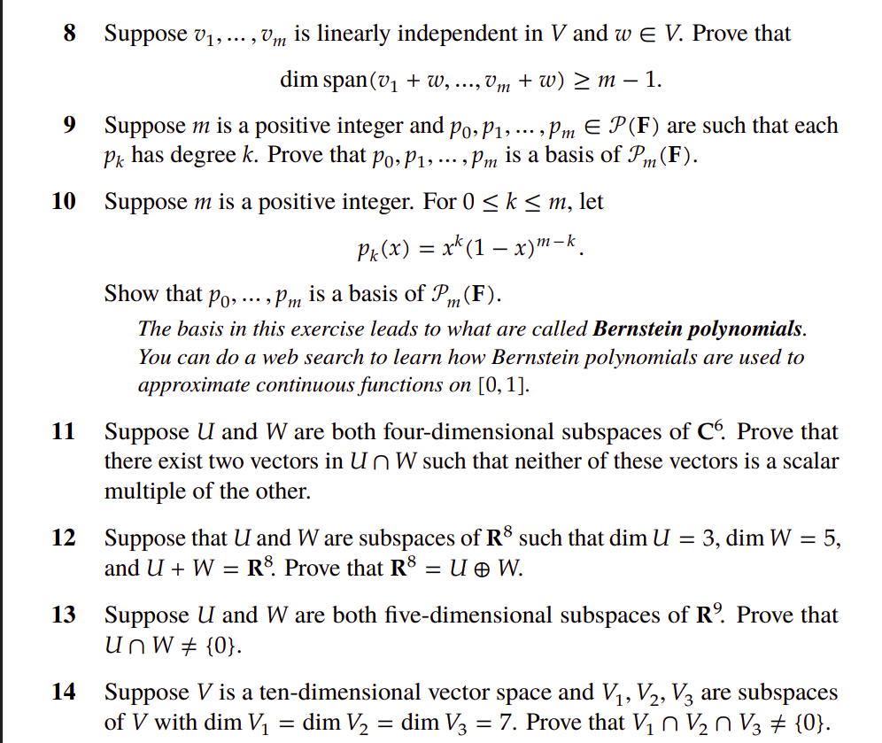

# Section 3

## Problem 1

The dimension of $\mathbb{R}^n$ is $n$. Any subspace in $\mathbb{R}^2$ can have dimension 0, 1, or 2. 

- dimension 0: the zero subspace
- dimension 1: $a \cdot v$ for some vector $v$: which is a line through the origin
- dimension 2: $\mathbb{R}^2$ itself

## Problem 2

The dimension of $\mathbb{R}^3$ is $3$. Any subspace in $\mathbb{R}^3$ can have dimension 0, 1, 2, or 3. 

- dimension 0: the zero subspace
- dimension 1: $a \cdot v$ for some vector $v$: which is a line through the origin
- dimension 2: $a \cdot v + b \cdot w$ for some independent vectors $v$ and $w$: which is a plane through the origin
- dimension 3: $\mathbb{R}^3$ itself

## Problem 3

1) Find a basis of $U$

a polynomial $$p \in U \iff p = (z - 6) \cdot q(z)$$ for some polynomial $q(z) \in \mathbb{F}^3$

Given that $\{1, z, z^2, z^3\}$ is a basis of $P_3(\mathbb{F})$, 

$$
\begin{align*}
p \in U \iff p = (z - 6) \cdot q(z) \\
\iff p = (z - 6) \cdot (a_0 + a_1 z + a_2 z^2 + a_3 z^3) \\
\iff p = a_0 \cdot (z - 6) + a_1 \cdot (z - 6) \cdot z + a_2 \cdot (z - 6) \cdot z^2 + a_3 \cdot (z - 6) \cdot z^3 \\
\end{align*}
$$

we have $I = \{z - 6, z - 6 \cdot z, (z - 6) \cdot z^2, (z - 6) \cdot z^3\}$ is a spanning list of $U$. 

We know that $\{1, z, z^2, z^3\}$ is independent, and since 

$$
\begin{align*}
\sum_{i = 0}^3 \alpha_i \cdot (z - 6) \cdot z^i &= (z - 6) \sum_{i = 0}^3 \alpha_i \cdot z^i \\
\end{align*}
$$

the set $I$ is independent. Therefore, $I$ is a basis of $U$. 

2. Extend the basis $U$ to a basis of $P_4(\mathbb{F})$

$$
\begin{align*}
I &= \{z - 6, z - 6 \cdot z, (z - 6) \cdot z^2, (z - 6) \cdot z^3\} \\
&= \{z - 6, z^2 - 6 \cdot z, z^3 - 6 \cdot z^2, z^4 - 6 \cdot z^3\} \\
\end{align*}
$$

I claim that ${1}$ + $I$ is a basis of $P_4(\mathbb{F})$. I will prove it using the matrix multiplication method.

The only evident basis of $P_4(\mathbb{F})$ is $\{1, z, z^2, z^3, z^4\}$.  

$$
\begin{align*}
{1} + I &= \{1, z, z^2, z^3, z^4\} \\ 

\begin{bmatrix}
1 && z - 6 && z^2 - 6 \cdot z && z^3 - 6 \cdot z^2 && z^4 - 6 \cdot z^3 \\
\end{bmatrix}
&= 
\begin{bmatrix}
1 && z && z^2 \cdot z && z^3 \cdot z^2 && z^4 \cdot z^3 \\
\end{bmatrix}
\cdot 
\begin{bmatrix}
1 && -6 && 0 && 0 && 0 \\
0 && 1 && -6 && 0 && 0 \\
0 && 0 && 1 && -6 && 0 \\
0 && 0 && 0 && 1 && -6 \\
0 && 0 && 0 && 0 && 1 \\
\end{bmatrix}
\end{align*}
$$

Given that the matrix is invertible (upper diagonal matrix), we have that ${1}$ + $I$ is a basis of $P_4(\mathbb{F})$. 

c) Find a subspace $W$ of $P_4(\mathbb{F})$ such that $P_4(\mathbb{F}) = U \oplus W$

We know that ${1}$ + $I$ is a basis of $P_4(\mathbb{F})$. Using result 2 from [section2.md](./section2.md), we know that $W = \text{span} \{1\}$ (the set of constant polynomials) is a subspace that answers the question.  

## Problem 8

Let $v_1,\dots ,v_m\in V$ be linearly independent and let $w\in V$.  We want to show that 

$$\dim\operatorname{span}(v_1+w,\dots ,v_m+w)\ge m-1$$

We split the proof into two cases.

**Case 1 – $w\notin\operatorname{span}(v_1,\dots ,v_m)$.**  

By Result 3 from [section2.md](./section2.md), the list $v_1,\dots ,v_m,w$ is linearly independent.  

$$ 
\begin{align*}
\sum_{i=1}^{m}\alpha_i\,(v_i+w) &= 0 \\
\implies \sum_{i=1}^{m}\alpha_i v_i + \sum_{i=1}^{m}\alpha_i w &= 0 \\
\implies \sum_{i=1}^{m}\alpha_i v_i &= - \sum_{i=1}^{m}\alpha_i w \\
\text{if} ~~ \sum_{i=1}^{m}\alpha_i = 0 
\implies \sum_{i=1}^{m}\beta_i v_i &= w \text{ for some } \beta_i \in \mathbb{F} \\
 \implies w \in \text{span}(v_1, v_2, ... v_m) \text{ (contradiction)} \\
\implies \sum_{i=1}^{m}\alpha_i = 0 \\
\implies \beta_i = 0 \text{ for all } i \\
\end{align*}
$$

hence 

$$
\dim\operatorname{span}(v_1+w,\dots ,v_m+w)=m\ge m-1 
$$

**Case 2 – $w\in\operatorname{span}(v_1,\dots ,v_m)$.**  

If $w=0$ the conclusion is immediate, so assume $w\ne 0$.

Because the $v_i$ form a basis of their span, the representation of $w$ is unique:

$$
w=\sum_{i=1}^{m}\beta_i v_i,\qquad\text{with at least one }\beta_i\ne 0 
$$

Without loss of generality suppose $\beta_m\ne 0$.  

Consider the $(m-1)$ vectors

$$
v_1+w,\;v_2+w,\;\dots ,\;v_{m-1}+w 
$$

Suppose $\sum_{i=1}^{m-1}\alpha_i\,(v_i+w)=0$.

Proceeding exactly as above we get

$$
\sum_{i=1}^{m-1}\alpha_i v_i+\Bigl(\sum_{i=1}^{m-1}\alpha_i\Bigr)
\bigl(\!\!\sum_{j=1}^{m}\beta_j v_j\bigr)=0 
$$

Collect the coefficients of each $v_k$; for $k=m$ the coefficient equals

$$
\beta_m\sum_{i=1}^{m-1}\alpha_i
$$

Since $\beta_m\ne 0$, this forces $\sum_{i=1}^{m-1}\alpha_i=0$

which implies

$$
\sum_{i=1}^{m-1}\alpha_i v_i = 0
$$

and hence all $\alpha_i=0$ and the list is linearly independent. Therefore

$$
\dim\operatorname{span}(v_1+w,\dots ,v_m+w)\ge m-1 
$$

In both cases the desired inequality holds, completing the proof.

## Problem 9

Let $m\in\mathbb{N}$ and let $p_0,\dots ,p_m\in \mathcal{P}(\mathbb{F})$
with $\deg p_k=k$ for every $k$.  
The vector space $P_m(\mathbb{F})$ of polynomials of degree at most $m$
has dimension $m+1$, so it suffices to show that the given polynomials
are linearly independent.

We prove by induction on $k$ that the list
$p_0,p_1,\dots ,p_k$ is linearly independent for each $k\le m$.

*Base step ($k=0$).*  
$p_0$ is a non–zero constant polynomial, hence independent.

*Induction step.*  
Assume $p_0,\dots ,p_k$ are independent.  
Since $\deg p_{k+1}=k+1$, no linear combination of $p_0,\dots ,p_k$
can equal $p_{k+1}$ (any such combination would have degree at most
$k$). Thus $p_{k+1}$ is **not** in the span of the previous polynomials,
and by Result 3 from [section2.md](./section2.md), the enlarged list
$p_0,\dots ,p_k,p_{k+1}$ is independent.

By induction $p_0,\dots ,p_m$ are linearly independent.
Having $m+1$ independent vectors in an $(m+1)$–dimensional space,
they form a basis of $P_m(\mathbb{F})$.

## Problem 11

Let $U$ and $W$ be four–dimensional subspaces of $\mathbb{C}^6$.
Using the dimension formula

$$
\dim(U+W)=\dim U+\dim W-\dim(U\cap W)
$$

we obtain

$$
\dim(U\cap W)=\dim U+\dim W-\dim(U+W)\ge 4+4-6=2 
$$

because $U+W\subseteq\mathbb{C}^6$ implies $\dim(U+W)\le 6$.

Hence $U\cap W$ has dimension at least 2, so it contains at least two
linearly independent vectors, none a scalar multiple of the other.

## Problem 12

Let $U,W\subseteq\mathbb{R}^8$ with $\dim U=3$, $\dim W=5$ and
$U+W=\mathbb{R}^8$.  Then

$$
\dim(U\cap W)=\dim U+\dim W-\dim(U+W)=3+5-8=0 
$$

Hence $U\cap W=\{0\}$ and, because $U+W=\mathbb{R}^8$,

$$
\mathbb{R}^8=U\oplus W 
$$

## Problem 13

Let $U,W$ be five–dimensional subspaces of $\mathbb{R}^9$.
Since $U+W\subseteq\mathbb{R}^9$, $\dim(U+W)\le 9$ and therefore

$$
\dim(U\cap W)=\dim U+\dim W-\dim(U+W)\ge 5+5-9=1 
$$

Thus $U\cap W$ contains a non–zero vector; in particular
$U\cap W\ne\{0\}$.

## Problem 14

Let $\dim V=10$ and let $V_1,V_2,V_3\subseteq V$ with
$\dim V_i =7$ for each $i$.
First compute the dimensions of the pairwise intersections:

$$  
\dim(V_1\cap V_2)\;=\;7+7-\dim(V_1+V_2)\;\ge\;14-10=4 
$$

and similarly 

$$
\dim(V_1\cap V_3)\ge 4 \\
\dim(V_2\cap V_3)\ge 4
$$

Set

$$
A=V_1\cap V_2,\qquad B=V_1\cap V_3 
$$

Both $A$ and $B$ are subspaces of $V_1$ of dimension at least 4.
Consequently their sum is contained in $V_1$, so

$$
\dim(A+B)\le \dim V_1 = 7 
$$

Applying the dimension formula once more gives

$$
\dim(A\cap B)=\dim A+\dim B-\dim(A+B)\;\ge\;4+4-7=1 
$$

But $A\cap B=(V_1\cap V_2)\cap(V_1\cap V_3)=V_1\cap V_2\cap V_3$,
so this intersection has dimension at least 1 and therefore contains
a non–zero vector.  Hence

$$
V_1\cap V_2\cap V_3\;\neq\;\{0\}
$$

This completes the argument.

