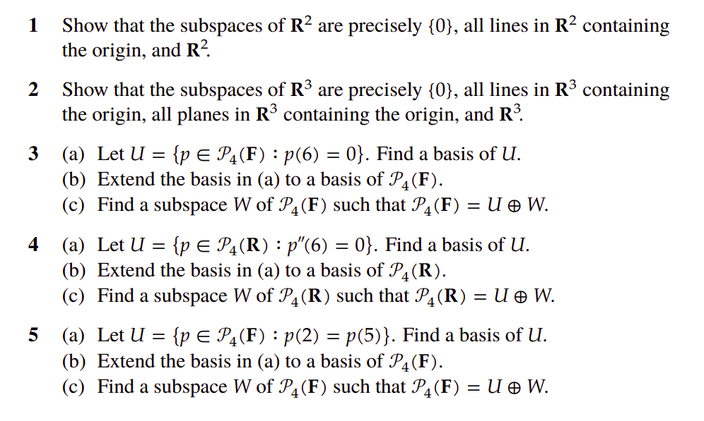
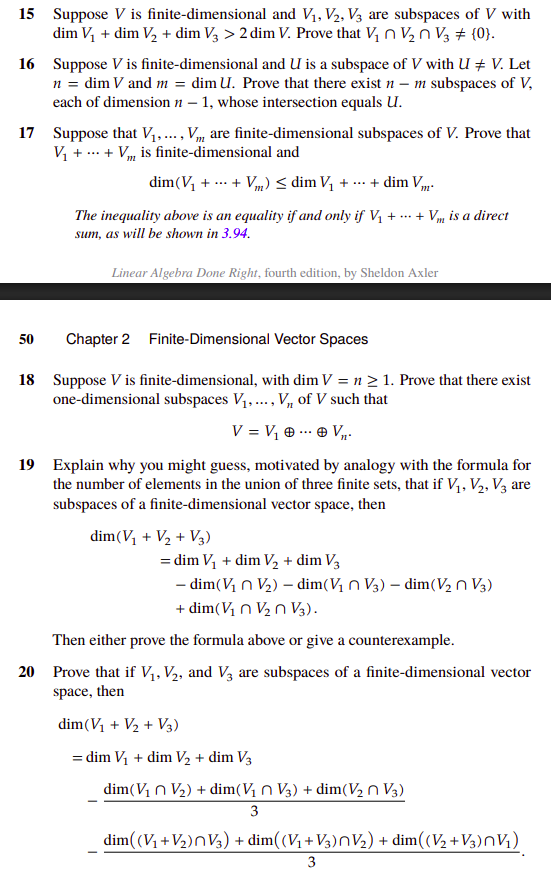

# Section 3

## Problem 1

The dimension of $\mathbb{R}^n$ is $n$. Any subspace in $\mathbb{R}^2$ can have dimension 0, 1, or 2. 

- dimension 0: the zero subspace
- dimension 1: $a \cdot v$ for some vector $v$: which is a line through the origin
- dimension 2: $\mathbb{R}^2$ itself

## Problem 2

The dimension of $\mathbb{R}^3$ is $3$. Any subspace in $\mathbb{R}^3$ can have dimension 0, 1, 2, or 3. 

- dimension 0: the zero subspace
- dimension 1: $a \cdot v$ for some vector $v$: which is a line through the origin
- dimension 2: $a \cdot v + b \cdot w$ for some independent vectors $v$ and $w$: which is a plane through the origin
- dimension 3: $\mathbb{R}^3$ itself

## Problem 3

1) Find a basis of $U$

a polynomial $$p \in U \iff p = (z - 6) \cdot q(z)$$ for some polynomial $q(z) \in \mathbb{F}^3$

Given that $\{1, z, z^2, z^3\}$ is a basis of $P_3(\mathbb{F})$, 

$$
\begin{align*}
p \in U \iff p = (z - 6) \cdot q(z) \\
\iff p = (z - 6) \cdot (a_0 + a_1 z + a_2 z^2 + a_3 z^3) \\
\iff p = a_0 \cdot (z - 6) + a_1 \cdot (z - 6) \cdot z + a_2 \cdot (z - 6) \cdot z^2 + a_3 \cdot (z - 6) \cdot z^3 \\
\end{align*}
$$

we have $I = \{z - 6, z - 6 \cdot z, (z - 6) \cdot z^2, (z - 6) \cdot z^3\}$ is a spanning list of $U$. 

We know that $\{1, z, z^2, z^3\}$ is independent, and since 

$$
\begin{align*}
\sum_{i = 0}^3 \alpha_i \cdot (z - 6) \cdot z^i &= (z - 6) \sum_{i = 0}^3 \alpha_i \cdot z^i \\
\end{align*}
$$

the set $I$ is independent. Therefore, $I$ is a basis of $U$. 

2. Extend the basis $U$ to a basis of $P_4(\mathbb{F})$

$$
\begin{align*}
I &= \{z - 6, z - 6 \cdot z, (z - 6) \cdot z^2, (z - 6) \cdot z^3\} \\
&= \{z - 6, z^2 - 6 \cdot z, z^3 - 6 \cdot z^2, z^4 - 6 \cdot z^3\} \\
\end{align*}
$$

I claim that ${1}$ + $I$ is a basis of $P_4(\mathbb{F})$. I will prove it using the matrix multiplication method.

The only evident basis of $P_4(\mathbb{F})$ is $\{1, z, z^2, z^3, z^4\}$.  

$$
\begin{align*}
{1} + I &= \{1, z, z^2, z^3, z^4\} \\ 

\begin{bmatrix}
1 && z - 6 && z^2 - 6 \cdot z && z^3 - 6 \cdot z^2 && z^4 - 6 \cdot z^3 \\
\end{bmatrix}
&= 
\begin{bmatrix}
1 && z && z^2 \cdot z && z^3 \cdot z^2 && z^4 \cdot z^3 \\
\end{bmatrix}
\cdot 
\begin{bmatrix}
1 && -6 && 0 && 0 && 0 \\
0 && 1 && -6 && 0 && 0 \\
0 && 0 && 1 && -6 && 0 \\
0 && 0 && 0 && 1 && -6 \\
0 && 0 && 0 && 0 && 1 \\
\end{bmatrix}
\end{align*}
$$

Given that the matrix is invertible (upper diagonal matrix), we have that ${1}$ + $I$ is a basis of $P_4(\mathbb{F})$. 

c) Find a subspace $W$ of $P_4(\mathbb{F})$ such that $P_4(\mathbb{F}) = U \oplus W$

We know that ${1}$ + $I$ is a basis of $P_4(\mathbb{F})$. Using result 2 from [section2.md](./section2.md), we know that $W = \text{span} \{1\}$ (the set of constant polynomials) is a subspace that answers the question.  

## Problem 8

Let $v_1,\dots ,v_m\in V$ be linearly independent and let $w\in V$.  We want to show that 

$$\dim\operatorname{span}(v_1+w,\dots ,v_m+w)\ge m-1$$

We split the proof into two cases.

**Case 1 – $w\notin\operatorname{span}(v_1,\dots ,v_m)$.**  

By Result 3 from [section2.md](./section2.md), the list $v_1,\dots ,v_m,w$ is linearly independent.  

$$ 
\begin{align*}
\sum_{i=1}^{m}\alpha_i\,(v_i+w) &= 0 \\
\implies \sum_{i=1}^{m}\alpha_i v_i + \sum_{i=1}^{m}\alpha_i w &= 0 \\
\implies \sum_{i=1}^{m}\alpha_i v_i &= - \sum_{i=1}^{m}\alpha_i w \\
\text{if} ~~ \sum_{i=1}^{m}\alpha_i = 0 
\implies \sum_{i=1}^{m}\beta_i v_i &= w \text{ for some } \beta_i \in \mathbb{F} \\
 \implies w \in \text{span}(v_1, v_2, ... v_m) \text{ (contradiction)} \\
\implies \sum_{i=1}^{m}\alpha_i = 0 \\
\implies \beta_i = 0 \text{ for all } i \\
\end{align*}
$$

hence 

$$
\dim\operatorname{span}(v_1+w,\dots ,v_m+w)=m\ge m-1 
$$

**Case 2 – $w\in\operatorname{span}(v_1,\dots ,v_m)$.**  

If $w=0$ the conclusion is immediate, so assume $w\ne 0$.

Because the $v_i$ form a basis of their span, the representation of $w$ is unique:

$$
w=\sum_{i=1}^{m}\beta_i v_i,\qquad\text{with at least one }\beta_i\ne 0 
$$

Without loss of generality suppose $\beta_m\ne 0$.  

Consider the $(m-1)$ vectors

$$
v_1+w,\;v_2+w,\;\dots ,\;v_{m-1}+w 
$$

Suppose $\sum_{i=1}^{m-1}\alpha_i\,(v_i+w)=0$.

Proceeding exactly as above we get

$$
\sum_{i=1}^{m-1}\alpha_i v_i+\Bigl(\sum_{i=1}^{m-1}\alpha_i\Bigr)
\bigl(\!\!\sum_{j=1}^{m}\beta_j v_j\bigr)=0 
$$

Collect the coefficients of each $v_k$; for $k=m$ the coefficient equals

$$
\beta_m\sum_{i=1}^{m-1}\alpha_i
$$

Since $\beta_m\ne 0$, this forces $\sum_{i=1}^{m-1}\alpha_i=0$

which implies

$$
\sum_{i=1}^{m-1}\alpha_i v_i = 0
$$

and hence all $\alpha_i=0$ and the list is linearly independent. Therefore

$$
\dim\operatorname{span}(v_1+w,\dots ,v_m+w)\ge m-1 
$$

In both cases the desired inequality holds, completing the proof.

## Problem 9

Let $m\in\mathbb{N}$ and let $p_0,\dots ,p_m\in \mathcal{P}(\mathbb{F})$
with $\deg p_k=k$ for every $k$.  
The vector space $P_m(\mathbb{F})$ of polynomials of degree at most $m$
has dimension $m+1$, so it suffices to show that the given polynomials
are linearly independent.

We prove by induction on $k$ that the list
$p_0,p_1,\dots ,p_k$ is linearly independent for each $k\le m$.

*Base step ($k=0$).*  
$p_0$ is a non–zero constant polynomial, hence independent.

*Induction step.*  
Assume $p_0,\dots ,p_k$ are independent.  
Since $\deg p_{k+1}=k+1$, no linear combination of $p_0,\dots ,p_k$
can equal $p_{k+1}$ (any such combination would have degree at most
$k$). Thus $p_{k+1}$ is **not** in the span of the previous polynomials,
and by Result 3 from [section2.md](./section2.md), the enlarged list
$p_0,\dots ,p_k,p_{k+1}$ is independent.

By induction $p_0,\dots ,p_m$ are linearly independent.
Having $m+1$ independent vectors in an $(m+1)$–dimensional space,
they form a basis of $P_m(\mathbb{F})$.

## Problem 11

Let $U$ and $W$ be four–dimensional subspaces of $\mathbb{C}^6$.
Using the dimension formula

$$
\dim(U+W)=\dim U+\dim W-\dim(U\cap W)
$$

we obtain

$$
\dim(U\cap W)=\dim U+\dim W-\dim(U+W)\ge 4+4-6=2 
$$

because $U+W\subseteq\mathbb{C}^6$ implies $\dim(U+W)\le 6$.

Hence $U\cap W$ has dimension at least 2, so it contains at least two
linearly independent vectors, none a scalar multiple of the other.

## Problem 12

Let $U,W\subseteq\mathbb{R}^8$ with $\dim U=3$, $\dim W=5$ and
$U+W=\mathbb{R}^8$.  Then

$$
\dim(U\cap W)=\dim U+\dim W-\dim(U+W)=3+5-8=0 
$$

Hence $U\cap W=\{0\}$ and, because $U+W=\mathbb{R}^8$,

$$
\mathbb{R}^8=U\oplus W 
$$

## Problem 13

Let $U,W$ be five–dimensional subspaces of $\mathbb{R}^9$.
Since $U+W\subseteq\mathbb{R}^9$, $\dim(U+W)\le 9$ and therefore

$$
\dim(U\cap W)=\dim U+\dim W-\dim(U+W)\ge 5+5-9=1 
$$

Thus $U\cap W$ contains a non–zero vector; in particular
$U\cap W\ne\{0\}$.

## Problem 14

Let $\dim V=10$ and let $V_1,V_2,V_3\subseteq V$ with
$\dim V_i =7$ for each $i$.
First compute the dimensions of the pairwise intersections:

$$  
\dim(V_1\cap V_2)\;=\;7+7-\dim(V_1+V_2)\;\ge\;14-10=4 
$$

and similarly 

$$
\dim(V_1\cap V_3)\ge 4 \\
\dim(V_2\cap V_3)\ge 4
$$

Set

$$
A=V_1\cap V_2,\qquad B=V_1\cap V_3 
$$

Both $A$ and $B$ are subspaces of $V_1$ of dimension at least 4.
Consequently their sum is contained in $V_1$, so

$$
\dim(A+B)\le \dim V_1 = 7 
$$

Applying the dimension formula once more gives

$$
\dim(A\cap B)=\dim A+\dim B-\dim(A+B)\;\ge\;4+4-7=1 
$$

But $A\cap B=(V_1\cap V_2)\cap(V_1\cap V_3)=V_1\cap V_2\cap V_3$,
so this intersection has dimension at least 1 and therefore contains
a non–zero vector.  Hence

$$
V_1\cap V_2\cap V_3\;\neq\;\{0\}
$$

This completes the argument.

<!--  -->

## Problem 15

Let $V$ be a finite-dimensional vector space, and let $V_1, V_2, V_3$ be subspaces of $V$. We are given that $\dim V_1 + \dim V_2 + \dim V_3 > 2 \dim V$. We want to prove that $V_1 \cap V_2 \cap V_3 \neq \{0\}$.

We start with the general dimension formula for the intersection of two subspaces $U$ and $W$ of $V$:
$$
\dim(U \cap W) = \dim U + \dim W - \dim(U+W)
$$
Since $U+W$ is a subspace of $V$, its dimension is at most $\dim V$. This gives us a useful inequality:
$$
\dim(U \cap W) \ge \dim U + \dim W - \dim V \tag{1}
$$

Now, we apply this inequality twice. First, let $U=V_1$ and $W=V_2$ in equation (1):
$$
\dim(V_1 \cap V_2) \ge \dim V_1 + \dim V_2 - \dim V \tag{2}
$$

Next, we apply equation (1) again with $U = V_1 \cap V_2$ and $W=V_3$:
$$
\dim(V_1 \cap V_2 \cap V_3) \ge \dim(V_1 \cap V_2) + \dim V_3 - \dim V
$$
Substituting the result from equation (2) into this inequality, we get:
$$
\begin{align*}
\dim(V_1 \cap V_2 \cap V_3) &\ge (\dim V_1 + \dim V_2 - \dim V) + \dim V_3 - \dim V \\
&= \dim V_1 + \dim V_2 + \dim V_3 - 2 \dim V
\end{align*}
$$
We are given that $\dim V_1 + \dim V_2 + \dim V_3 > 2 \dim V$. Therefore, the right-hand side is strictly positive:
$$
\dim(V_1 \cap V_2 \cap V_3) > 0
$$
A subspace with a dimension greater than 0 cannot be the zero subspace. Thus, $V_1 \cap V_2 \cap V_3 \neq \{0\}$.

## Problem 16

Let $\dim V = n$ and let $U$ be a subspace of $V$ with $\dim U = m$ and $U \neq V$. We need to find $n-m$ subspaces of $V$, each of dimension $n-1$, whose intersection is $U$.

Let $\{u_1, \dots, u_m\}$ be a basis for $U$. Since $U \neq V$, we can extend this to a basis for $V$: $\{u_1, \dots, u_m, w_1, \dots, w_{n-m}\}$.

For each $i \in \{1, \dots, n-m\}$, define a subspace $X_i$ as follows:
$$
X_i = \operatorname{span}(u_1, \dots, u_m, w_1, \dots, w_{i-1}, w_{i+1}, \dots, w_{n-m})
$$
The spanning list for $X_i$ consists of $m + (n-m-1) = n-1$ vectors from a basis of $V$, so they are linearly independent. Thus, $\dim X_i = n-1$ for each $i$.

We need to show that $\bigcap_{i=1}^{n-m} X_i = U$.

**1. Show $U \subseteq \bigcap_{i=1}^{n-m} X_i$:**

The basis vectors of $U$, $\{u_1, \dots, u_m\}$, are included in the spanning set for every $X_i$. Therefore, $U \subseteq X_i$ for all $i$, which implies $U \subseteq \bigcap_{i=1}^{n-m} X_i$.

**2. Show $\bigcap_{i=1}^{n-m} X_i \subseteq U$:**
Let $x \in \bigcap_{i=1}^{n-m} X_i$. Since $x \in V$, it has a unique representation in the basis of $V$:
$$
x = \sum_{j=1}^m \alpha_j u_j + \sum_{k=1}^{n-m} \beta_k w_k
$$
For $x$ to be in the intersection, it must belong to every subspace $X_i$. Let's focus on a single subspace $X_i$ and show that if $x \in X_i$, its corresponding coefficient $\beta_i$ must be zero.

Let's define a vector $y$ composed of all the terms in the expansion of $x$ that are guaranteed to be in $X_i$:
$$
y = \sum_{j=1}^m \alpha_j u_j + \sum_{k=1, k\neq i}^{n-m} \beta_k w_k
$$
By construction, every vector in the sums for $y$ is in the spanning set of $X_i$, so $y \in X_i$.
Since $X_i$ is a subspace and both $x$ and $y$ are in it, their difference must also lie in $X_i$:
$$
x - y = \beta_i w_i
$$
But by its definition, $X_i = \operatorname{span}(u_1, \dots, u_m, w_1, \dots, w_{i-1}, w_{i+1}, \dots, w_{n-m})$. The vector $w_i$ is linearly independent of the vectors in the basis of $X_i$. The only way a scalar multiple of $w_i$ can be in $X_i$ is if the scalar is zero. Therefore, $\beta_i = 0$.

This logic applies for every $i \in \{1, \dots, n-m\}$. Thus, all coefficients $\beta_1, \dots, \beta_{n-m}$ must be zero, which simplifies the expression for $x$ to:
$$
x = \sum_{j=1}^m \alpha_j u_j
$$
This means $x \in \operatorname{span}(u_1, \dots, u_m) = U$.

Combining both inclusions, we have $\bigcap_{i=1}^{n-m} X_i = U$.

## Problem 17
We want to prove by induction that for finite-dimensional subspaces $V_1, \dots, V_m$ of $V$:
$$
\dim(V_1 + \dots + V_m) \le \dim V_1 + \dots + \dim V_m
$$

**Base Case (m=2):**
For two subspaces, the dimension formula states:
$$
\dim(V_1 + V_2) = \dim V_1 + \dim V_2 - \dim(V_1 \cap V_2)
$$
Since dimension is always non-negative, $\dim(V_1 \cap V_2) \ge 0$.
Thus, $\dim(V_1 + V_2) \le \dim V_1 + \dim V_2$. The base case holds.

**Inductive Step:**
Assume the inequality holds for any $m-1$ subspaces. Let's prove it for $m$.
Let $W = V_1 + \dots + V_{m-1}$. Then $V_1 + \dots + V_m = W + V_m$.
Using the base case for the two subspaces $W$ and $V_m$:
$$
\dim(W + V_m) \le \dim W + \dim V_m
$$
Substituting back $W = V_1 + \dots + V_{m-1}$:
$$
\dim(V_1 + \dots + V_m) \le \dim(V_1 + \dots + V_{m-1}) + \dim V_m
$$
By the induction hypothesis, $\dim(V_1 + \dots + V_{m-1}) \le \dim V_1 + \dots + \dim V_{m-1}$.
Applying this to the right side of the inequality:
$$
\dim(V_1 + \dots + V_m) \le (\dim V_1 + \dots + \dim V_{m-1}) + \dim V_m
$$
This completes the inductive proof.

## Problem 18

Suppose $V$ is finite-dimensional with $\dim V = n \ge 1$. We want to find one-dimensional subspaces $V_1, \dots, V_n$ of $V$ such that $V = V_1 \oplus \dots \oplus V_n$.

Let $\{u_1, \dots, u_n\}$ be a basis of $V$.
For each $i \in \{1, \dots, n\}$, define the subspace $V_i = \operatorname{span}(u_i)$.
Since $u_i$ is a basis vector, it is non-zero, so $\dim V_i = 1$.

To show that $V = V_1 \oplus \dots \oplus V_n$, we need to show that the sum is direct. This is equivalent to showing that any vector $v \in V$ can be written as a unique sum $v = v_1 + \dots + v_n$ where each $v_i \in V_i$.

Let $v \in V$. Since $\{u_1, \dots, u_n\}$ is a basis for $V$, there exist unique scalars $\alpha_1, \dots, \alpha_n$ such that:
$$
v = \alpha_1 u_1 + \dots + \alpha_n u_n
$$
Let $v_i = \alpha_i u_i$. By definition, $v_i \in \operatorname{span}(u_i) = V_i$.
So, $v = v_1 + \dots + v_n$. The existence of such a sum is proven.
The uniqueness of the scalars $\alpha_i$ in the basis expansion implies the uniqueness of the vectors $v_i$.
Therefore, the sum is direct, and $V = V_1 \oplus \dots \oplus V_n$.

## Problem 19
The proposed formula is:
$$ \dim(V_1+V_2+V_3) = \dim V_1 + \dim V_2 + \dim V_3 - \dim(V_1 \cap V_2) - \dim(V_1 \cap V_3) - \dim(V_2 \cap V_3) + \dim(V_1 \cap V_2 \cap V_3) $$
This formula is incorrect. Let's provide a counterexample.

Let $V = \mathbb{R}^2$. Consider three distinct one-dimensional subspaces (lines through the origin):
- $V_1 = \operatorname{span}((1, 0))$
- $V_2 = \operatorname{span}((0, 1))$
- $V_3 = \operatorname{span}((1, 1))$

Let's compute the dimensions for the formula:
- $\dim V_1 = 1$, $\dim V_2 = 1$, $\dim V_3 = 1$.
- Any two of these lines only intersect at the origin, so $V_1 \cap V_2 = V_1 \cap V_3 = V_2 \cap V_3 = \{0\}$. Their dimensions are all 0.
- The intersection of all three is also just $\{0\}$, so $\dim(V_1 \cap V_2 \cap V_3) = 0$.
- The sum $V_1 + V_2 = \operatorname{span}((1,0), (0,1)) = \mathbb{R}^2$.
- The sum $V_1 + V_2 + V_3 = \mathbb{R}^2 + V_3 = \mathbb{R}^2$. So $\dim(V_1+V_2+V_3) = 2$.

Now, let's plug these into the proposed formula:
- **LHS**: $\dim(V_1+V_2+V_3) = 2$.
- **RHS**: $1 + 1 + 1 - 0 - 0 - 0 + 0 = 3$.

Since $2 \neq 3$, the formula is false.

## Problem 20

The main trick is to write $S = V_1+V_2+V_3$ in three different ways: 

1. $\dim S = \dim((V_1+V_2)+V_3) = \dim(V_1+V_2) + \dim V_3 - \dim((V_1+V_2)\cap V_3)$
2. $\dim S = \dim((V_1+V_3)+V_2) = \dim(V_1+V_3) + \dim V_2 - \dim((V_1+V_3)\cap V_2)$
3. $\dim S = \dim((V_2+V_3)+V_1) = \dim(V_2+V_3) + \dim V_1 - \dim((V_2+V3)\cap V_1)$

expand the first one:

$$
\begin{align*}
\dim(V_1+V_2+V_3) &= \dim(V_1+V_2) + \dim V_3 - \dim((V_1+V_2)\cap V_3) \\
&= (\dim V_1 + \dim V_2 - \dim(V_1 \cap V_2)) + \dim V_3 - \dim((V_1+V_2)\cap V_3) \\
&= \dim V_1 + \dim V_2 + \dim V_3 - \dim(V_1 \cap V_2) - \dim((V_1+V_2)\cap V_3)
\end{align*}
$$

Similarly,
$$
\dim(V_1+V_2+V_3) = \dim V_1 + \dim V_2 + \dim V_3 - \dim(V_1 \cap V_3) - \dim((V_1+V_3)\cap V_2)
$$
$$
\dim(V_1+V_2+V_3) = \dim V_1 + \dim V_2 + \dim V_3 - \dim(V_2 \cap V_3) - \dim((V_2+V_3)\cap V_1)
$$
Summing these three identities:
$$
\begin{align*}
3 \dim(V_1+V_2+V_3) = 3(\dim V_1 + \dim V_2 + \dim V_3) \\
- (\dim(V_1 \cap V_2) + \dim(V_1 \cap V_3) + \dim(V_2 \cap V_3)) \\
- (\dim((V_1+V_2)\cap V_3) + \dim((V_1+V_3)\cap V_2) + \dim((V_2+V_3)\cap V_1))
\end{align*}
$$

Divide by 3 to get the identity from the textbook..
