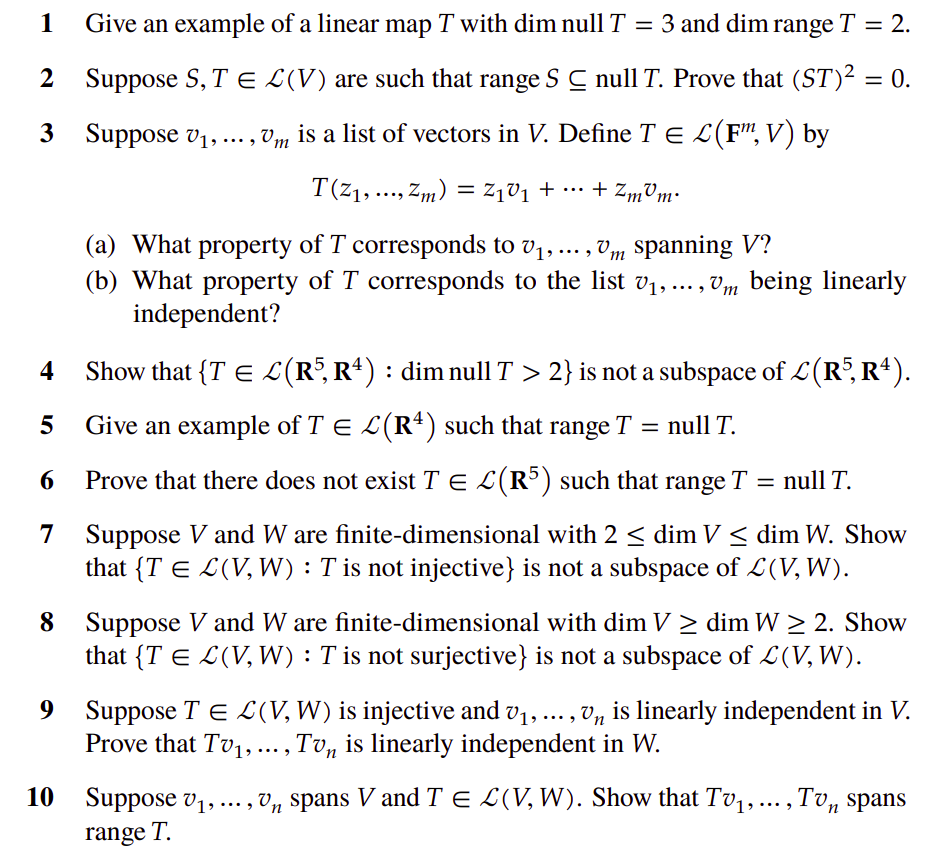

# Results: Fundamental Theorem of Linear Maps and Key Consequences

Let $T:V\to W$ be a linear map between finite–dimensional vector spaces.

---

### Fundamental Theorem of Linear Maps (FTLM)
For every such $T$ we have
$$
 d(V)
 \,=\, d\bigl(N(T)\bigr) + d\bigl(R(T)\bigr).
$$
Here $d(\cdot)$ denotes dimension, $N(T)$ the null space (kernel) and $R(T)$ the range (image).

---

### Result 1 (Injectivity preserves independence)
If $v_1,\dots,v_n$ are linearly independent **and** $T$ is injective, then the images $T(v_1),\dots,T(v_n)$ are linearly independent.

**Proof.**  Assume a relation
$$
\begin{align*}
\sum_{i=1}^n \alpha_i T(v_i) &= 0 \\ 
T\Bigl( \sum_{i=1}^n \alpha_i v_i \Bigr) &= 0 \\
\implies \sum_{i=1}^n \alpha_i v_i = 0 && \text{because $T$ is injective}
\end{align*} \\
$$

Independence of the $v_i$ forces every $\alpha_i=0$, so the images are independent.

---

### Result 2 (Independence of images implies independence of pre-images)
If $T(v_1),\dots,T(v_n)$ are linearly independent, then so are $v_1,\dots,v_n$.

**Proof.**  Suppose
$$
 \sum_{i=1}^n \alpha_i v_i = 0.
$$
Apply $T$:
$$
 T\Bigl( \sum_{i=1}^n \alpha_i v_i \Bigr) = \sum_{i=1}^n \alpha_i T(v_i) = 0.
$$
Independence of the $T(v_i)$ gives $\alpha_i=0$ for every $i$.

---

### Result 3 (Spanning sets map onto the range)
If $v_1,\dots,v_n$ span $V$, then $T(v_1),\dots,T(v_n)$ span $R(T)$.

**Proof.**  

Inclusion $\operatorname{span}\{T(v_i)\}\subseteq R(T)$ is clear.  

For the reverse inclusion take any $x\in R(T)$.  There is some $u\in V$ with $x=T(u)$.  Because the $v_i$ span $V$ we can write:

$$
 u = \sum_{i=1}^n \alpha_i v_i \quad \Longrightarrow \quad x = T(u) = \sum_{i=1}^n \alpha_i T(v_i).
$$

Hence $x$ lies in the span of the images, so
$$
 R(T) = \operatorname{span}\{T(v_1),\dots,T(v_n)\}. 
$$

---

### Result 4 (A basis adapted to $T$)

Suppose $V$ possesses a basis

$$
 \bigl(u_1,\dots,u_m,\;v_1,\dots,v_n\bigr)
$$
with
$$
 T(u_i)=0 \quad (1\le i\le m),\qquad T(v_1),\dots,T(v_n) \text{ linearly independent.}
$$

Then
$$
 (u_1,\dots,u_m) \text{ is a basis of } N(T),\qquad
 \bigl(T(v_1),\dots,T(v_n)\bigr) \text{ is a basis of } R(T).
$$

**Proof.**
First, every $u_i$ lies in $N(T)$, hence
$$
 \operatorname{span}\{u_i\}\subseteq N(T). \tag{2}
$$
Conversely, take $u\in N(T)$ and expand it in the given basis:
$$
\begin{align*}
\sum_{i=1}^m \alpha_i u_i + \sum_{j=1}^n \beta_j v_j &= u \\ 
\sum_{j=1}^n \beta_j T(v_j)&= T(u) \\ 
\implies \sum_{j=1}^n \beta_j T(v_j) &= 0
\end{align*}
$$

Because the $T(v_j)$ are independent, every $\beta_j=0$.  Thus $u\in\operatorname{span}\{u_i\}$ and together with (2) we have

$$
 N(T)=\operatorname{span}\{u_i\}.
$$

To identify $R(T)$ 
$$
\begin{align*}
x\in R(T) &\implies x = T(w) \text{ for some } w\in V \\
\implies w &= \sum_{i=1}^m \gamma_i u_i + \sum_{j=1}^n \delta_j v_j \\
x &= T(w)= \sum_{i=1}^m \gamma_i T(u_i) + \sum_{j=1}^n \delta_j T(v_j) \\
x &= 0 + \sum_{j=1}^n \delta_j T(v_j) \in \operatorname{span}\{T(v_j)\} \\
\therefore R(T)&= \operatorname{span}\{T(v_1),\dots,T(v_n)\}.
\end{align*}
$$

Since the $T(v_j)$ are already known to be linearly independent, they form a basis of $R(T)$.

# Problem 1
