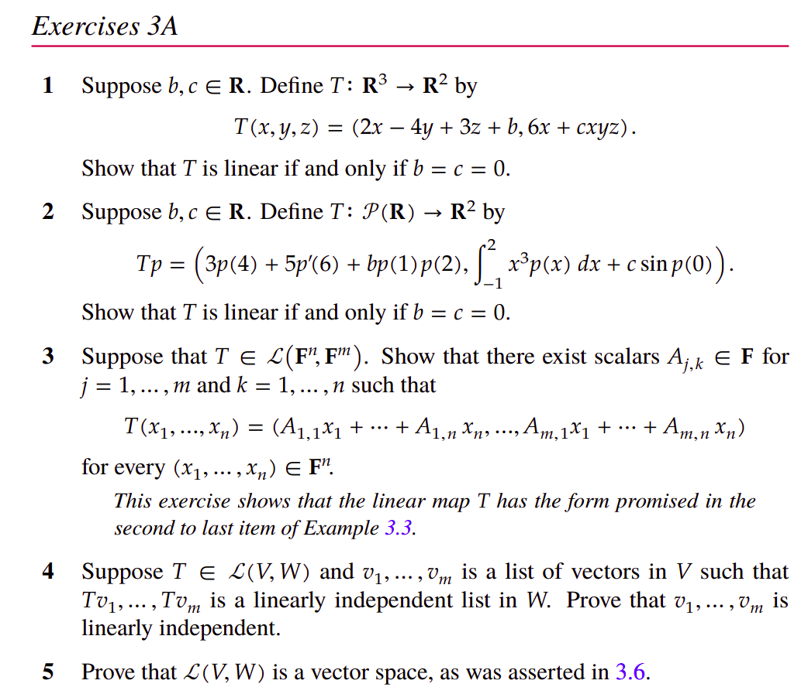
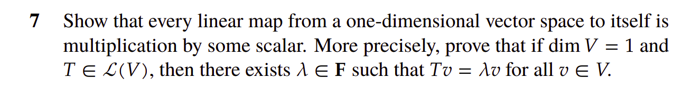
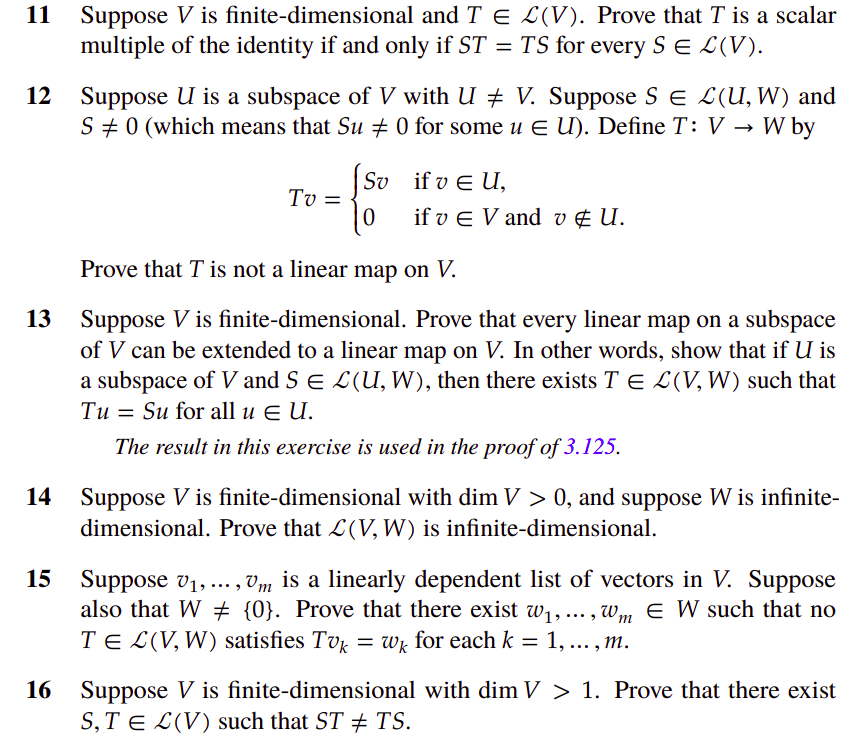

## Problem 1

Let $b,c\in\mathbb{R}$ and define $T:\mathbb{R}^3\to\mathbb{R}^2$ by
$$
T(x,y,z)\;=\;(2x-4y+3z+b,\;6x+cxyz).
$$
We prove that $T$ is linear **iff** $b=c=0$.

---
### ($\Leftarrow$)  If $b=c=0$ then $T$ is linear
With $b=c=0$ we have $T(x,y,z)=(2x-4y+3z,6x)$, clearly a linear combination of the coordinates, hence linear.

---
### ($\Rightarrow$)  If $T$ is linear then $b=c=0$

1. **Scalar-multiplication test for $b$.**  
   For any $\alpha\in\mathbb{R}$ and $(x,y,z)\in\mathbb{R}^3$, linearity requires
   $T(\alpha x,\alpha y,\alpha z)=\alpha T(x,y,z)$.  
   Taking $(x,y,z)=(0,0,1)$ gives
   $$
   T(0,0,\alpha)=\bigl(3\alpha+b,\,0\bigr),\qquad
   \alpha T(0,0,1)=\alpha(3+b,0).
   $$
   Equating first components yields $3\alpha+b=3\alpha+\alpha b$, so $b=\alpha b$ for every $\alpha$.  Choosing $\alpha\neq1$ forces $b=0$.

2. **Additivity test for $c$.**  
   By linearity
   $$
   T(1,0,0)+T(1,1,1)=T\bigl((1,0,0)+(1,1,1)\bigr)=T(2,1,1).
   $$
   Compute each term:

   $$
   \begin{align*}
   T(1,0,0)&=(2+b,6),\\
   T(1,1,1)&=(2-4+3+b,6+c)= (1+b,6+c),\\
   T(2,1,1)&=(4-4+3+b,12+2c)= (3+b,12+2c).
   \end{align*}
   $$ 

   Summing the first two vectors and comparing with the third shows the second components satisfy $6+(6+c)=12+2c$, which implies $c=0$.

Hence $b=c=0$, completing the proof.

---
## Problem 2

Let $b,c\in\mathbb{R}$ and define $T:\mathcal{P}(\mathbb{R})\to\mathbb{R}^2$ by
$$
Tp=\Bigl(3p(4)+5p'(6)+b\,p(1)p(2),\;\displaystyle\int_{-1}^{2}x^{3}p(x)\,dx+c\,\sin p(0)\Bigr).
$$
We show $T$ is linear **iff** $b=c=0$.

---
### Sufficiency
If $b=c=0$ then each component of $Tp$ is a linear functional of $p$: evaluation at points, derivative evaluation, and a definite integral against a fixed weight. Thus $T$ is linear.

---
### Necessity
Suppose $T$ is linear.

1. **Condition $b=0$.**  
   Linearity in scalar multiplication demands $T(\alpha p)=\alpha Tp$.  Take a polynomial $p$ such that $p(1)p(2)\neq0$ (e.g. $p(x)=1$).  The first component yields
   $$3\alpha p(4)+5\alpha p'(6)+b\,\alpha^2 p(1)p(2)=\alpha\bigl(3p(4)+5p'(6)+b p(1)p(2)\bigr).
   $$
   Comparing coefficients of $\alpha^2$ gives $b p(1)p(2)=0$, hence $b=0$.

2. **Condition $c=0$.**  
   Additivity requires $T(p+q)=Tp+Tq$.  Choose $p,q$ such that $p(0)=q(0)=\pi/2$ so that $\sin p(0)=\sin q(0)=1$ but $(p+q)(0)=\pi$, whence $\sin(p+q)(0)=0$.  The second component gives
   $$\int_{-1}^{2}x^{3}(p+q)\,dx+c\sin(p+q)(0)=\int_{-1}^{2}x^{3}p\,dx+\int_{-1}^{2}x^{3}q\,dx+2c.
   $$
   The integrals cancel, leaving $0=2c$, so $c=0$.

Therefore $b=c=0$.

---
## Problem 3

Let $T\in\mathcal{L}(\mathbb{F}^n,\mathbb{F}^m)$.  Denote by $e^{(n)}_1,\dots,e^{(n)}_n$ the standard basis of $\mathbb{F}^n$ and by $e^{(m)}_1,\dots,e^{(m)}_m$ the standard basis of $\mathbb{F}^m$.

For any $x=(x_1,\dots,x_n)\in\mathbb{F}^n$ we have the decomposition
$$
 x=\sum_{k=1}^{n}x_k e^{(n)}_k.
$$
Linearity gives
$$
T(x)=\sum_{k=1}^{n}x_k\,T(e^{(n)}_k).
$$
Write each image $T(e^{(n)}_k)$ in the $e^{(m)}_j$ basis:
$$
T(e^{(n)}_k)=\sum_{j=1}^{m}A_{j,k}\,e^{(m)}_j,\qquad A_{j,k}\in\mathbb{F}.
$$
Substituting,
$$
T(x)=\sum_{k=1}^{n}x_k\Bigl(\sum_{j=1}^{m}A_{j,k}e^{(m)}_j\Bigr)=\sum_{j=1}^{m}\Bigl(\sum_{k=1}^{n}A_{j,k}x_k\Bigr)e^{(m)}_j.
$$
Thus
$$
T(x_1,\dots,x_n)=\bigl(A_{1,1}x_1+\dots+A_{1,n}x_n,\;\dots,\;A_{m,1}x_1+\dots+A_{m,n}x_n\bigr),
$$
which is precisely the matrix–vector product with the $m\times n$ matrix $A=(A_{j,k})$.

---
## Problem 4

Let $T\in\mathcal{L}(V,W)$ and suppose $v_1,\dots,v_m\in V$ with $Tv_1,\dots,Tv_m$ linearly independent in $W$.  We prove $v_1,\dots,v_m$ are independent in $V$.

Assume a relation
$$
\sum_{i=1}^{m}\alpha_i v_i=0.
$$
Apply $T$ and use linearity together with $T(0)=0$:
$$
0=T(0)=T\Bigl(\sum_{i=1}^{m}\alpha_i v_i\Bigr)=\sum_{i=1}^{m}\alpha_i T(v_i).
$$
Because the family $\{T(v_i)\}$ is linearly independent, all coefficients must vanish, i.e. $\alpha_i=0$ for every $i$.  Therefore the original vectors are linearly independent.

---
## Problem 7

