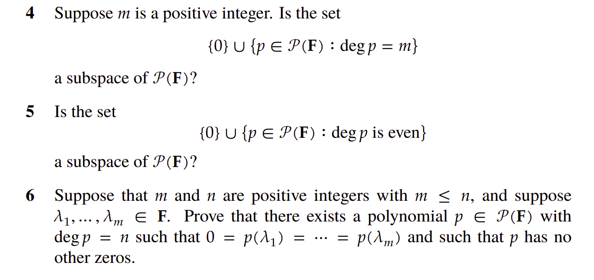

# Problem 4 

$$
\begin{align*}
\text{Choose } &p_1(x)=\sum_{i=0}^{m}\alpha_i x^{i},\;\alpha_m\ne 0,\\
               &p_2(x)=\sum_{i=0}^{m}\beta_i x^{i},\;\beta_m\ne 0,\\
\text{with } &\alpha_m+\beta_m = 0 \;{\text{(leading coefficients cancel)}}.\\[6pt]
\deg p_1 &= m,\; \deg p_2 = m \;{\text{so }} p_1,p_2 \text{ lie in the set}.\\[6pt]
\deg\bigl(p_1+p_2\bigr) &= m-1 \;\;{\text{since the }x^{m}\text{ term vanishes}},\\
\Longrightarrow &\;p_1+p_2 \text{ is \emph{not} in the set}.\\[6pt]
\therefore &\;\text{the set is not closed under addition }\implies\text{ not a subspace.}
\end{align*}
$$

---

# Problem 5  

*The same construction as in Problem 4 works.*

$$
\begin{align*}
\text{Take the same } p_1,p_2 &\text{ with } \deg=p_1=p_2=m,\\
\alpha_m+\beta_m=0 &\;{\text{so }} \deg(p_1+p_2)=m-1<m.\\
\text{Hence }p_1,p_2 &\text{ belong to the set but } p_1+p_2 \text{ does not}.\\
\text{Set not closed }&\text{ under addition }\implies\text{ not a subspace.}
\end{align*}
$$

---

# Problem 6  

For distinct scalars $\lambda_1,\lambda_2,\dots,\lambda_m\in\mathbb F$ and integers $n\ge m$ define
$$
 p(x)=\bigl(x-\lambda_1\bigr)^{\,n-m+1}\,(x-\lambda_2)\cdots(x-\lambda_m).
$$

$$
\begin{align*}
\deg p &= (n-m+1) + (m-1) = n,\\[4pt]
p(\lambda_1)&=0 \text{ with multiplicity } n-m+1,\\
p(\lambda_j)&=0 \;(j=2,\dots,m) \text{ with multiplicity }1.
\end{align*}
$$

Since a polynomial of degree $n$ has at most $n$ roots, $p$ has no other rools besides $\lambda_1,\dots,\lambda_m$. The polynomial $p$ satisfies the problem's requirements.

---

# Problem 8  
Let $p\in\mathcal P(\mathbb F)$ have degree $m$ with roots $\lambda_1,\dots,\lambda_m$ (listed with multiplicity):
$$
p(x)=\prod_{i=1}^{m}(x-\lambda_i).
$$
Using **Result 1** from *results.md*
$$
p'(x)=\sum_{i=1}^{m}\;q_i(x),\qquad q_i(x)=\prod_{\substack{j=1\\ j\ne i}}^{m}(x-\lambda_j).
$$

---
### Forward direction — distinct roots $\Rightarrow$ $p$ and $p'$ share none
$$
\begin{align*}
q_j(\lambda_k)&=0 \;(j\ne k) \quad\{\text{every factor contains }(x-\lambda_k)\}\;\\[2pt]
p'(\lambda_j)&=q_j(\lambda_j) \quad \{\text{all other }q_k\text{ vanish at }x=\lambda_j\}\,;\\[4pt]
\text{since }q_j\text{ has roots }\{\lambda_i:i\ne j\}&\text{ and }\lambda_j\notin\{\lambda_i:i\ne j\},\;q_j(\lambda_j)\ne0.\\[4pt]
\therefore p'(\lambda_j)&\ne0\;(j=1,\dots,m)\;\Longrightarrow\;p\text{ and }p'\text{ have no common root.}
\end{align*}
$$

---
### Reverse direction — no common roots $\Rightarrow$ distinct roots
Assume $p$ and $p'$ have no common roots yet two indices $i\ne j$ satisfy $\lambda_i=\lambda_j$.
$$
q_i(\lambda_i)=\prod_{\substack{k=1\\k\ne i}}^{m}(\lambda_i-\lambda_k)=0 \quad\{\text{because }k=j \text{ term vanishes}\},
$$
so $p'(\lambda_i)=q_i(\lambda_i)=0$, contradicting the “no common root’’ assumption.  Hence all roots are distinct.

---

# Problem 9  
**A real–coefficient polynomial of odd degree has at least one real root.**

$$
\begin{align*}
& p(x)=\sum_{k=0}^{m}\alpha_k x^k,\;\alpha_k\in\mathbb R,\;m\text{ odd}. \\[6pt]
p(x) &=0 \;\Rightarrow\; \text{roots appear as }\;z,\overline{z}\;\text{(Result 3)}.\\
&\text{If none were real, roots would come in }\tfrac{m}{2}\text{ pairs }(z,\overline z).\\
&\text{But }m\text{ is odd}\;\Longrightarrow\text{ impossible}.\\[4pt]
\therefore &\;p\text{ must possess at least one real root.}
\end{align*}
$$

---

# Problem 11  
Given $p\in\mathbb C[x]$ define
$$
Q(x)=p(x)\,\overline{p(\overline{x})}.
$$
Show that $Q$ has real coefficients.

$$
\begin{align*}
\text{For a real }z&\;(\overline z=z):\\[2pt]
Q(z)&=p(z)\,\overline{p(\overline z)}=p(z)\,\overline{p(z)}.\\[4pt]
\overline{Q(z)}&=\overline{p(z)}\,p(z)=Q(z).\\[6pt]
\therefore\;&Q(z)\in\mathbb R\quad\forall z\in\mathbb R.
\end{align*}
$$

Since $Q$ takes real values on every real input, **Result 2** (real-valued on $\mathbb R$ $\Leftrightarrow$ real coefficients) implies that all coefficients of $Q$ are real.

---

# Problem 12  

let 
$$
p(x)=\sum_{k=0}^{m}\alpha_k x^{k}~~\alpha_k\in\mathbb C \\

q(x)=\sum_{k=0}^{m}(\alpha_k-\overline{\alpha_k})x^{k}.
$$

for real numbers $x$, 

$$
q(x)=p(x)-\overline{p(x)}.
$$

q is a polynomial of degree $\le m$ that vanishes at $m+1$ distinct points; hence $q\equiv0$.  From the coefficient comparison each coefficient of $p$ equals its complex conjugate, so all coefficients are real.

---

