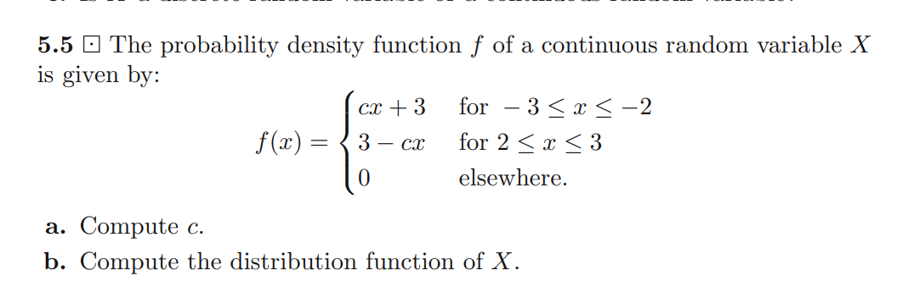

# Overview

This is my attempt to solve the most interesting Random Variables problems from the book "Modern Introduction to Probability" by Dimitri P. Bertsekas and John N. Tsitsiklis.

# Chapter 4: Discrete Random Variables

## Problem 4.6

Three times we randomly draw a number from the following numbers:
123.
If $X_i$ represents the ith draw, $i = 1, 2, 3$, then the probability mass function
of $X_i$ is given by
a 123
$$
P(X_i = a) = \frac{1}{3} \quad \text{for} \quad a = 1, 2, 3
$$

and $P(X_i = a) = 0 $ for all other $a$. 

We assume that each draw is independent of the previous draws. Let $X$ be the average of $X_1, X_2, X_3$, i.e.,

$$X = \frac{X_1 + X_2 + X_3}{3}$$

a. determine the probability mass function of $X$ 

b. compute the probability that exactly 2 draws are equal to 1.

a. it is mainly about enumerating all $3^3 = 27$ possible outcomes and counting the number of outcomes for each value of $X$. 

b. we are supposed to compute $P(Y = 2)$ where $Y$ is the number of times the number 1 is drawn. $ Y \approx Bernoulli(p = \frac{1}{3}, n = 3)$ 

## Problem 4.11

You decide to play monthly in two different lotteries, and you stop playing as soon as you win a prize in one (or both) lotteries of at least one million euros. Suppose that every time you participate in these lotteries, the probability to win one million (or more) euros is $p_1$ for one of the lotteries and $p_2$ for the other. Let $M$ be the number of times you participate in these lotteries until winning at least one prize. What kind of distribution does $M$ have, and what is its parameter?

- The distribution is geometric with parameter $p = 1 - (1 - p_1)(1 - p_2) = p_1 + p_2 - p_1p_2$

## Problem 4.12

You and a friend want to go to a concert, but unfortunately only one ticket is still available. The man who sells the tickets decides to toss a coin until heads appears. In each toss heads appears with probability $p$, where $0 <p< 1$, independent of each of the previous tosses. If the number of tosses needed is odd, your friend is allowed to buy the ticket; otherwise you can buy it. Would you agree to this arrangement?

let $X$ be the number of tosses needed to get heads. $X \approx Geometric(p)$ 

$$
\begin{align*}
P(X ~ \text{odd}) &= \sum_{k=0}^{\infty} P(X = 2k+1) \\
&= \sum_{k=0}^{\infty} (1-p)^{2k}p \\
&= p \sum_{k=0}^{\infty} (1-p)^{2k} \\
&= p \frac{1}{1-(1-p)^2} \\
&= \frac{1}{2-p}
\end{align*}
$$

Since $p > 0$ we have $P(X ~ \text{odd}) > \frac{1}{2}$. Hence I would not agree to this arrangement. 

## Problem 4.14

We throw a coin until a head turns up for the second time, where p is the
probability that a throw results in a head and we assume that the outcome
of each throw is independent of the previous outcomes. Let X be the number
of times we have thrown the coin. 

b. find $P(x = n)$ for $n \geq 2$ 

for a given $n$, we have a sample space where $n - 1$ coins are tossed
and a sample space where only one coin is tossed (the last coin). 

$$
\begin{align*}
P(X = n) &= P(\text{head in the last toss}) \times P(n - 1 ~ \text{tosses are tails}) \\
&= p \times \binom{n-1}{1} \times (1-p)^{n-2} \cdot p\\
&= (n - 1) \cdot p^2 (1-p)^{n-2}
\end{align*}
$$

# Chapter 5: Continuous Random Variables

The most interesting problem in this chapter is 5.5

1. Compute $F(-2)$ in terms of $c$
2. prove that $F(t) = F(-2)$ for all $-3 \leq t \leq -2$
3. prove that $F(t) = 1$ for $t \geq 3$
4. compute $F(3) - F(2)$ using integration and $F(3) - F(2) = 1 - F(2)$
5. find $c$

- Step1:

$$
\begin{align*}
F(-2) &= P(X \leq -2) \\
&= \int_{-\infty}^{-2} c \cdot x + 3 \, dx \\
&= 3 - \frac{c}{2} 
\end{align*}
$$

- Step2:

Since $f(x) = 0$ for $ x \in [-2, 2]$, then $F(t) = F(-2)$ for all $-2 \leq t \leq 2$

-Step 3:

$$
\begin{align*}
1 &= \int_{-\infty}^{\infty} f(x) \, dx \\
&= \int_{-\infty}^{3} f(x) \, dx
+ \int_{3}^{\infty} f(x) \, dx \\
&= F(3) + 0 \\ 
&\implies F(3) = 1
\end{align*}
$$

- Step4:

$$
\begin{align*}
F(3) - F(2) &= \int_{2}^{3} f(x) \, dx \\
&= \int_{2}^{3} c \cdot x + 3 \, dx \\
&= 3 - \frac{c}{2} 
\end{align*}
$$

also 

$$
\begin{align*}
F(3) - F(2) &= 1 - F(2) \\
&= 1 - (3 - \frac{c}{2}) \\
&= -2 + \frac{c}{2}
\end{align*}
$$

- Step5:

$$
\begin{align*}
-2 + \frac{c}{2} &= 3 - \frac{c}{2} \\
&\implies c = 5
\end{align*}
$$

the answer can be verified in the book (answers to selected problems part)

## Problem 5.11

Compute the median of an $Exp(\lambda)$ random variable. 

The idea is to find the value $m$ such that $P(X \leq m) = 0.5$

$$
\begin{align*}
P(X \leq m) &= \int_{0}^{m} \lambda e^{-\lambda x} \, dx \\
&= 1 - e^{-\lambda m}
\end{align*}
$$

$$
\begin{align*}
1 - e^{-\lambda m} &= 0.5 \\
&\implies e^{-\lambda m} = 0.5 \\
&\implies -\lambda m = \ln(0.5) \\
&\implies m = \frac{\ln(2)}{\lambda}
\end{align*}
$$

# Chapter 7: Expectation and Variance

