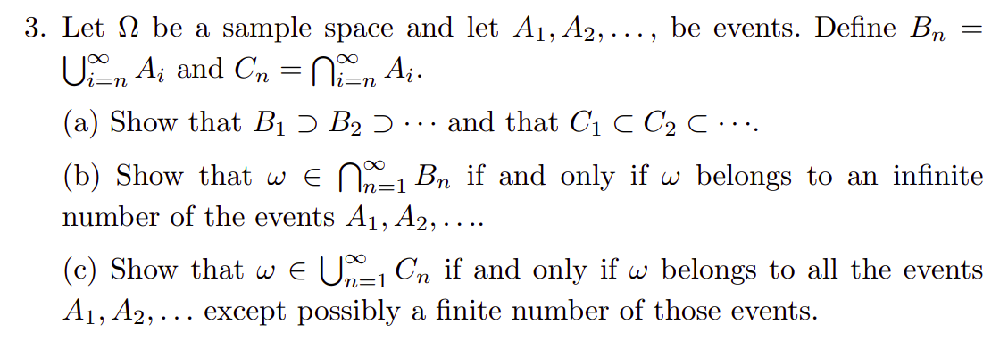
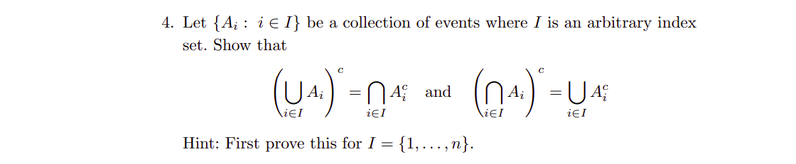

# Overview

This is my attempt to solve the problems in chapter 1 of the book "All of Statistics" by Larry Wasserman. The book is available [here](https://egrcc.github.io/docs/math/all-of-statistics.pdf).

The book does an amazing job covering powerful and useful concepts in probability and statistics. 

# Problem 1.3 

// ... existing code ...

## Problem 3

Let $\Omega$ be a sample space and let $A_1, A_2, \ldots$, be events. Define $B_n = \bigcup_{i=n}^{\infty} A_i$ and $C_n = \bigcap_{i=n}^{\infty} A_i$.

### (a) Show that $B_1 \supset B_2 \supset \cdots$ and that $C_1 \subset C_2 \subset \cdots$.

**Proof:**

For any $n \geq 1$, we have:

$$
\begin{align*}
B_{n+1} &= \bigcup_{i=n+1}^{\infty} A_i \\
&= A_{n+1} \cup A_{n+2} \cup A_{n+3} \cup \cdots
\end{align*}
$$

$$
\begin{align*}
B_n &= \bigcup_{i=n}^{\infty} A_i \\
&= A_n \cup A_{n+1} \cup A_{n+2} \cup \cdots \\
&= B_{n+1} \cup A_n \\
&\implies B_n \supset B_{n+1}
\end{align*}
$$

Hence the result.

Similarly, for any $n \geq 1$:

$$
\begin{align*}
C_{n+1} &= \bigcap_{i=n+1}^{\infty} A_i \\
&= A_{n+1} \cap A_{n+2} \cap \cdots
\end{align*}
$$

$$
\begin{align*}
C_n &= \bigcap_{i=n}^{\infty} A_i \\
&= A_n \cap A_{n+1} \cap A_{n+2} \cap \cdots \\
&= C_{n+1} \cap A_n \\
&\implies C_n \subset C_{n+1}
\end{align*}
$$

Hence the result.

### (b) Show that $\omega \in \bigcap_{n=1}^{\infty} B_n$ if and only if $\omega$ belongs to an infinite number of the events $A_1, A_2, \ldots$

**Proof:**

$(\Rightarrow)$ Assume, by contradiction, that $\omega \in \bigcap_{n=1}^{\infty} B_n$ but $\omega$ belongs to only a finite number of events $A_i$. Then there exists an integer $N$ such that $\omega \notin A_i$ for all $i > N$. 

Consider $B_{N+1} = \bigcup_{i=N+1}^{\infty} A_i$. Since $\omega \notin A_i$ for all $i > N$, we have $\omega \notin B_{N+1}$. But this contradicts our assumption that $\omega \in \bigcap_{n=1}^{\infty} B_n$, which includes $B_{N+1}$.

$(\Leftarrow)$ Suppose $\omega$ belongs to infinitely many events $A_i$. Then for any $n \geq 1$, there exists some $N \geq n$ such that $\omega \in A_N$. Since $A_N \subset B_n$ (as $N \geq n$), we have $\omega \in B_n$ for all $n \geq 1$. Therefore, $\omega \in \bigcap_{n=1}^{\infty} B_n$.

## (c) Show that $\omega \in \bigcup_{n=1}^{\infty} C_n$ if and only if $\omega$ belongs to all the events $A_1, A_2, \ldots$ except possibly a finite number of those events.

**Proof:**

$(\Rightarrow)$ Suppose $\omega \in \bigcup_{n=1}^{\infty} C_n$. Then there exists some $k \geq 1$ such that $\omega \in C_k = \bigcap_{i=k}^{\infty} A_i$. This means $\omega \in A_i$ for all $i \geq k$. Therefore, $\omega$ belongs to all events $A_i$ except possibly the finite set $\{A_1, A_2, \ldots, A_{k-1}\}$.

$(\Leftarrow)$ Suppose $\omega$ belongs to all events $A_i$ except possibly a finite number of them. Then there exists some integer $k$ such that $\omega \in A_i$ for all $i \geq k$. This means $\omega \in \bigcap_{i=k}^{\infty} A_i = C_k$. Therefore, $\omega \in \bigcup_{n=1}^{\infty} C_n$.

// ... existing code ...

# Problem 4

Let's prove it for $I = \{1,2,\ldots,n\}$ first.

The case of $n = 2$ is the standard De Morgan's laws for two sets.

Assume that the identities hold for $I = \{1,2,\ldots,n\}$ for some $n \geq 2$:

1. $\left(\bigcup_{i=1}^{n} A_i\right)^c = \bigcap_{i=1}^{n} A_i^c$
2. $\left(\bigcap_{i=1}^{n} A_i\right)^c = \bigcup_{i=1}^{n} A_i^c$

Prove that for $n + 1$ the properties hold.

$$
\begin{align*}
\left(\bigcup_{i=1}^{n+1} A_i\right)^c &= \left(\left(\bigcup_{i=1}^{n} A_i\right) \cup A_{n+1}\right)^c \\
&= \left(\bigcup_{i=1}^{n} A_i\right)^c \cap A_{n+1}^c \\
&= \bigcap_{i=1}^{n} A_i^c \cap A_{n+1}^c \\
&= \bigcap_{i=1}^{n+1} A_i^c
\end{align*}
$$

similar for the second identity:

$$
\begin{align*}
\left(\bigcap_{i=1}^{n+1} A_i\right)^c &= \left(\left(\bigcap_{i=1}^{n} A_i\right) \cap A_{n+1}\right)^c \\
&= \left(\bigcap_{i=1}^{n} A_i\right)^c \cup A_{n+1}^c \\
&= \bigcup_{i=1}^{n} A_i^c \cup A_{n+1}^c \\
&= \bigcup_{i=1}^{n+1} A_i^c
\end{align*}
$$

Hence the result is proved for $I = \{1, 2, \ldots, n\}$. A given index of size $n$ can be mapped to an index of the form $I = \{1, 2, \ldots, n\}$. Hence the results holds for any index set $J$.

## Problem 8

Suppose that $\mathbb{P}(A_i) = 1$ for each $i$. Prove that 

$$\mathbb{P}\left(\bigcap_{i=1}^{\infty} A_i\right) = 1.$$

**Solution:**

INTERMEDIATE RESULT: for any two events $A$ and $B$ 

$$
P(A) = P(B) = 1 \implies P(A \cap B) = 1 \text{ and } P(A \cup B) = 1
$$

Proof:

$$
\begin{align}
P(A \cup B) &= P(A) + P(B) - P(A \cap B) \\
&= 2 - P(A \cap B)
\end{align}
$$

By the axioms of probability, for any event $X$, we know that 

$$
\begin{align*}
\mathbb{P}(X) &\leq 1 \\
\implies 2 - \mathbb{P}(A \cap B) &\geq 1 \\
\implies 1 \geq P(A \cup B) &\geq 1 \\
\implies \mathbb{P}(A \cap B) &= 1
\end{align*}
$$

Now, define 
$$
C_n = \bigcap_{i=1}^{n} A_i, ~~ n \geq 1
$$ 

By induction, $P(C_n) = 1$ for each $n \geq 1$. 

- Base case ($n=1$): $C_1 = A_1$, so $\mathbb{P}(C_1) = \mathbb{P}(A_1) = 1$.

- Inductive step: Assume $\mathbb{P}(C_n) = 1$ for some $n \geq 1$.

- $C_{n+1} = C_n \cap A_{n+1}$, 

$$P(C_n) = 1 \text{ and } P(A_{n+1}) = 1 \implies P(C_{n+1}) = 1$$

Finally, note that $\bigcap_{i=1}^{\infty} A_i = \lim_{n \to \infty} C_n$. 

Since $\mathbb{P}(C_n) = 1$ for all $n$, we have:

$$\mathbb{P}\left(\bigcap_{i=1}^{\infty} A_i\right) = \mathbb{P}\left(\lim_{n \to \infty} C_n\right) = \lim_{n \to \infty} \mathbb{P}(C_n) = \lim_{n \to \infty} 1 = 1$$

Therefore, $\mathbb{P}\left(\bigcap_{i=1}^{\infty} A_i\right) = 1$.

## Problem 18

Suppose $k$ events form a partition of the sample space $\Omega$, i.e., they are disjoint and $\bigcup_{i=1}^k A_i = \Omega$. Assume that $\mathbb{P}(B) > 0$. Prove that if $\mathbb{P}(A_1|B) < \mathbb{P}(A_1)$ then $\mathbb{P}(A_i|B) > \mathbb{P}(A_i)$ for some $i = 2, \ldots, k$.

**Proof:**

If $\mathbb{P}(A_1|B) < \mathbb{P}(A_1)$, then:
$$\frac{\mathbb{P}(A_1 \cap B)}{\mathbb{P}(B)} < \mathbb{P}(A_1)$$

Multiplying both sides by $\mathbb{P}(B)$:
$$\mathbb{P}(A_1 \cap B) < \mathbb{P}(A_1) \cdot \mathbb{P}(B)$$

Now, assume by contradiction that $\mathbb{P}(A_i|B) \leq \mathbb{P}(A_i)$ for all $i = 2, \ldots, k$. This implies:
$$\mathbb{P}(A_i \cap B) \leq \mathbb{P}(A_i) \cdot \mathbb{P}(B) \quad \text{for all } i = 2, \ldots, k$$

Summing over all $i = 1, 2, \ldots, k$:
$$\sum_{i=1}^k \mathbb{P}(A_i \cap B) < \sum_{i=1}^k \mathbb{P}(A_i) \cdot \mathbb{P}(B)$$

Since the $A_i$'s form a partition, we have:
$$\sum_{i=1}^k \mathbb{P}(A_i \cap B) = \mathbb{P}(B)$$
$$\sum_{i=1}^k \mathbb{P}(A_i) = 1$$

Therefore:
$$\mathbb{P}(B) < \mathbb{P}(B) \cdot 1 = \mathbb{P}(B)$$

This is a contradiction. Hence, there must exist some $i \in \{2, \ldots, k\}$ such that $\mathbb{P}(A_i|B) > \mathbb{P}(A_i)$.

## Problem 11

Suppose that $A$ and $B$ are independent events. Show that $A^c$ and $B^c$ are independent events.

**Proof:**

For two events to be independent, we need to show that $\mathbb{P}(A^c \cap B^c) = \mathbb{P}(A^c) \cdot \mathbb{P}(B^c)$.

First, we know:
- $\mathbb{P}(A^c) = 1 - \mathbb{P}(A)$
- $\mathbb{P}(B^c) = 1 - \mathbb{P}(B)$

So:
$$\mathbb{P}(A^c) \cdot \mathbb{P}(B^c) = (1 - \mathbb{P}(A)) \cdot (1 - \mathbb{P}(B))$$
$$= 1 - \mathbb{P}(A) - \mathbb{P}(B) + \mathbb{P}(A) \cdot \mathbb{P}(B)$$

Next, we can find $\mathbb{P}(A^c \cap B^c)$. Using set theory, $A^c \cap B^c = (A \cup B)^c$. Therefore:
$$\mathbb{P}(A^c \cap B^c) = \mathbb{P}((A \cup B)^c) = 1 - \mathbb{P}(A \cup B)$$

For the union of events:
$$\mathbb{P}(A \cup B) = \mathbb{P}(A) + \mathbb{P}(B) - \mathbb{P}(A \cap B)$$

Since $A$ and $B$ are independent, $\mathbb{P}(A \cap B) = \mathbb{P}(A) \cdot \mathbb{P}(B)$. Therefore:
$$\mathbb{P}(A \cup B) = \mathbb{P}(A) + \mathbb{P}(B) - \mathbb{P}(A) \cdot \mathbb{P}(B)$$

Substituting back:
$$\mathbb{P}(A^c \cap B^c) = 1 - [\mathbb{P}(A) + \mathbb{P}(B) - \mathbb{P}(A) \cdot \mathbb{P}(B)]$$
$$= 1 - \mathbb{P}(A) - \mathbb{P}(B) + \mathbb{P}(A) \cdot \mathbb{P}(B)$$

Since $\mathbb{P}(A^c \cap B^c) = \mathbb{P}(A^c) \cdot \mathbb{P}(B^c)$, we have shown that $A^c$ and $B^c$ are independent events.