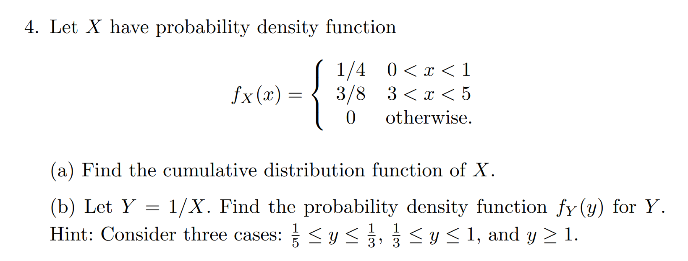

# Chapter 2: Random Variables

## Problem 4

Let $X$ have probability density function
$$f_X(x) = 
\begin{cases}
1/4 & 0 < x < 1 \\
3/8 & 3 < x < 5 \\
0 & \text{otherwise}.
\end{cases}$$

### (a) Find the cumulative distribution function of $X$.

The CDF is defined as $F_X(x) = P(X \leq x) = \int_{-\infty}^{x} f_X(t) \, dt$.

Computing this integral piecewise:

For $x \leq 0$: $F_X(x) = 0$ since the density is 0 in this region.

For $0 < x < 1$:
$$F_X(x) = \int_{0}^{x} \frac{1}{4} \, dt = \frac{1}{4}x$$

For $1 \leq x < 3$:
$$F_X(x) = F_X(1) = \frac{1}{4}$$

For $3 \leq x < 5$:
$$F_X(x) = F_X(3) + \int_{3}^{x} \frac{3}{8} \, dt = \frac{1}{4} + \frac{3}{8}(x-3) = \frac{3}{8}x - \frac{7}{8}$$

For $x \geq 5$:
$$F_X(x) = F_X(5) = \frac{3}{8} \cdot 5 - \frac{7}{8} = \frac{15}{8} - \frac{7}{8} = 1$$

Therefore, the CDF of $X$ is:
$$F_X(x) = 
\begin{cases}
0 & x \leq 0 \\
\frac{1}{4}x & 0 < x < 1 \\
\frac{1}{4} & 1 \leq x < 3 \\
\frac{3}{8}x - \frac{7}{8} & 3 \leq x < 5 \\
1 & x \geq 5
\end{cases}$$

### (b) Let $Y = 1/X$. Find the probability density function $f_Y(y)$ for $Y$.

Let's first find $F(y)$ for $Y$. 

$$
F(t) = 0  \quad \text{if} \quad t \leq 0 \\ 
$$

because $F(t) = P(Y \leq t) = P(1/X \leq t)$ and if $t \leq 0$, then $1/X \leq 0$

for $0 < t$, we have

$$
\begin{align*}
F(t) &= P(Y \leq t) \\
&= P(1/X \leq t) \\
&= P(X \geq 1/t) \\
&= 1 - P(X < 1/t) \\
F(t) &= 1 - F_X(1/t)
\end{align*}
$$

Differentiate to get $f_{Y}(t)$

$$
f_{Y}(t) = \frac{d}{dt} F(t) = \frac{d}{dt} (1 - F_X(1/t)) = -f_X(1/t) \cdot \frac{d}{dt}(1/t) = \frac{f_X(1/t)}{t^2}
$$

Therefore, the PDF of $Y$ is:
$$f_Y(y) = 
\begin{cases}
\frac{3}{8y^2} & \frac{1}{5} < y < \frac{1}{3} \\
\frac{1}{4y^2} & y > 1 \\
0 & \text{otherwise}
\end{cases}$$

## Problem 5 

 

I am not sure of the solution. However, Here is my attempt. The definition of two random variables $X$ and $Y$ being independent is that for any two sets $A$ and $B$, 

$$P(X \in A, Y \in B) = P(X \in A)P(Y \in B)$$

- First direction, $X$ and $Y$ are independent $\implies$ $f_{X,Y}(x,y) = f_X(x)f_Y(y)$

Well, this is straightforward, since 
$$
f_X(x) = P(X = x) = P(X \in \{x\})\\

\text{and} \\

f_Y(y) = P(Y = y) = P(Y \in \{y\})
$$

Hence 

$$
\begin{align*}
f_{X,Y}(x,y) &= P(X = x, Y = y) \\
&= P(X \in \{x\}, Y \in \{y\}) \\
&= P(X \in \{x\})P(Y \in \{y\}) \\
f_{X,Y}(x,y) &= f_X(x)f_Y(y)
\end{align*}
$$

The second direction is a bit trickier. It is important to keep in mind that $X \in A$ can be written as ${X = i : i \in A_i}$ where $A_i$ all the values in $A$.

and since $X = i$ are disjoint events for different $i$, we have 

$$
\begin{align*}
P(X \in A)  \cdot P(Y \in B) &= P(X = i : i \in A_i) \cdot P(Y = j : j \in B_j) \\
&= \sum_{i \in A_i} P(X = i) \cdot \sum_{j \in B_j} P(Y = j) \\
&= \sum_{(i, j) \in A_i \times B_j} P(X = i) P(Y = j) \\
&= \sum_{(i, j) \in A_i \times B_j} P(X = i, Y = j) \\
&= P(X \in A, Y \in B)
\end{align*}
$$

and hence the result. 

## Problem 8

 

Start, as always, with $P(X^{+} < t)$.

$$
P(X^{+} < t) = P(max(X, 0) < t) = P(X < t, 0 < t) = P(X < t)P(0 < t)
$$

and hence 

$$
F_{X^{+}}(t) = F_X(t) \cdot I_{t \geq 0}
$$

## Problem 10 

2 random variables $X$ and $Y$ are said to be independent if for any two sets $A$ and $B$, 

$$
P(X \in A, Y \in B) = P(X \in A)P(Y \in B)
$$ 

For any function $f$ and any set $A$, define $R_{f, A} = \{x : f(x) \in A\}$.

$$
\begin{align*}
P(g(X) \in A, h(Y) \in B) &= P(X \in R_{g, A}, Y \in R_{h, B}) \\  
&= P(X \in R_{g, A})P(Y \in R_{h, B}) \\
&= P(g(X) \in A)P(h(Y) \in B)
\end{align*}
$$

Hence the result. (I am not sure of the correctness of this solution.)

## Problem 11

### a)

we know that $P(X = 1, Y = 1) = 0$ while $P(X = 1) = 0.5$ and $P(Y = 1) = 0.5$

So $X$ and $Y$ are dependent. 

### b) 

for $N \approx Poisson(\lambda)$, we know that $P(N = k) = \frac{\lambda^k}{k!} e^{-\lambda}$ 

Since $X$ is conditioned on $N$, we have 

$$
\begin{align*}
P(X = k) &= \sum_{i=0}^{\infty} P(X = k, N = i) \\
&= \sum_{i=k}^{\infty} P(X = k | N = i)P(N = i) \\
&= \sum_{i=k}^{\infty} C_{i}^{k} \cdot p^k \cdot (1-p)^{i-k} \cdot \frac{\lambda^i}{i!} e^{-\lambda} \\
&= \frac{p^k e^{-\lambda} \cdot \lambda^{k}}{k!}  \sum_{i=k}^{\infty} \lambda^{i-k} \cdot \frac{(1-p)^{i-k}}{(i-k)!} \\
&= \frac{p^k e^{-\lambda} \cdot \lambda^{k}}{k!} \sum_{j=0}^{\infty} \lambda^{j} \cdot \frac{(1-p)^{j}}{j!} \\
&= \frac{p^k e^{-\lambda} \cdot \lambda^{k}}{k!} \cdot e^{\lambda(1-p)} \\
P(X = k) &= \frac{(p\lambda)^k e^{-p\lambda}}{k!}
\end{align*}
$$

which means that $X$ is a Poisson random variable with parameter $p\lambda$.

Similarly, we can show that $Y$ is a Poisson random variable with parameter $(1-p)\lambda$. 

The only thing left is to compute $P(X = i, Y = j)$

$$
\begin{align*}  
P(X = i, Y = j) &= P(X = i, Y = j | N = i + j)P(N = i + j) \\ 
&= C_{i+j}^{i} \cdot p^i \cdot (1-p)^{j} \cdot \frac{(\lambda)^{i+j} e^{-\lambda}}{(i+j)!} \\
&= \frac{(\lambda p)^i (\lambda (1-p))^j e^{-\lambda}}{i!j!}\\
&= P(X = i)P(Y = j )
\end{align*}
$$

So $X$ and $Y$ are independent.  

## Problem 20

Let $X, Y \sim \text{Uniform}(0, 1)$ be independent. Find the PDF for $X - Y$ and $X/Y$.

### Part 1: PDF of $Z = X - Y$

$$ F_Z(t) = P(X - Y \leq t) = P((X, Y) \in \{(x, y) : x - y \leq t\}) $$ 

for $t \notin [-1, 1]$, $F_Z(t) = 0$ 

for $ t \leq 0$ 

$$ 
\begin{align*}
F_Z(t) &= \int_A f_{X,Y}(x,y) dx dy \\ 
A &=  \{(x,y) : 1 \geq x \geq 0, 1 \geq y \geq x - t \} \\
&= \frac{(1 + t)^2}{2}
\end{align*}
$$

for $0 < t \leq 1$

$$
\begin{align*}
F_Z(t) &= \int_A f_{X,Y}(x,y) dx dy \\ 
A &=  \{(x,y) : 1 \geq x \geq 0, 1 \geq y \geq x - t \} \\
&= 1 - \frac{(1 - t)^2}{2}
\end{align*}
$$

$$
f_Z(t) = \frac{d}{dt} F_Z(t) = 
\begin{cases}
1 + t & \text{if } -1 \leq t \leq 0 \\
1 - t & \text{if } 0 < t \leq 1 \\
0 & \text{otherwise}
\end{cases}
$$

### Part 2: PDF of $W = X/Y$

For the ratio $W = X/Y$, we use the formula:

$P(w < 0) = 0$ since $X$ and $Y$ are positive. 

$$  
P(w < t) = P(X/Y < t) =P(\frac{1}{t} X < Y)
$$

if $t \leq 1$, 

$$
\begin{align*}
F_W(t) &= \int_{A} f_{X,Y}(x,y) dx dy \\ 
A &= \{ 0 \geq x \geq 1,  1 \geq y \geq x/t \} \\
&= \frac{1}{2} \cdot t
\end{align*}
$$

if $t \geq 1$

$$
F_W(t) = 1 - \frac{1}{2t}
$$

Therefore:
$$f_W(w) = 
\begin{cases}
\frac{1}{2} & \text{if } 0 \leq w \leq 1 \\
\frac{1}{2w^2} & \text{if } w > 1 \\
0 & \text{otherwise}
\end{cases}$$

