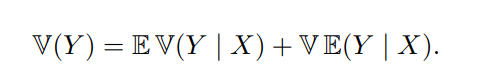

# Chapter 3: Expectation 

## Problem 3    

The first step is to determine the distribution of $Y$

$X_i ~ \text{Uniform}(0, 1)$ 

$F_{X_i}(x) = x \cdot I_{1 \geq x \geq 0}$ 

$$ \begin{align*}
P(Y < t) &= P(max(X_i) <t ) \\
&= P(X_1 < t, X_2 < t, \cdots, X_n < t) \\
&= \prod_{i=1}^{n} P(X_i < t) \\
P(Y < t) &= t^n
\end{align*} $$

$$ 
f_Y(t) = \frac{d}{dt} P(Y < t) = n t^{n-1} \cdot I_{0 \leq t \leq 1} 
$$ 

and hence the expectation 

$$
E[Y] = \int_{0}^{1} t \cdot f_Y(t) dt = \int_{0}^{1} t \cdot n t^{n-1} dt = n \int_{0}^{1} t^n dt = n \cdot \frac{1}{n+1} = \frac{n}{n+1}
$$

## Problem 10 

 

$$f_X(x) = \frac{1}{\sqrt{2\pi}} e^{-\frac{x^2}{2}}$$

$$ 
\begin{align*}
E[Y] &= E[e^X] \\
&= \int_{-\infty}^{\infty} e^x \cdot f_X(x) dx \\  
&= \frac{1}{\sqrt{2\pi}} \cdot \int_{-\infty}^{\infty} e^{\frac{-x^2 + 2x -1 + 1}{2}} dx \\
&= \frac{1}{\sqrt{2\pi}} \cdot e^{\frac{1}{2}} \cdot \int_{-\infty}^{\infty} e^{\frac{-(x-1)^2}{2}} dx \\
&= e^{\frac{1}{2}} \frac{1}{\sqrt{2\pi}} \cdot \int_{-\infty}^{\infty} e^{\frac{-(x-1)^2}{2}} dx \\
E[Y] &= e^{\frac{1}{2}}
\end{align*}
$$

$$
Var(Y) = E[Y^2] - E[Y]^2
$$

$$
\begin{align*}
E[Y^2] &= \int_{-\infty}^{\infty} e^{2x} \cdot f_X(x) dx \\
&= \frac{1}{\sqrt{2\pi}} \cdot e^{2} \cdot \int_{-\infty}^{\infty} e^{\frac{-(x-2)^2}{2}} dx \\
&= e^2 \frac{1}{\sqrt{2\pi}} \cdot \int_{-\infty}^{\infty} e^{\frac{-(x-2)^2}{2}} dx \\
E[Y^2] &= e^2

\end{align*}
$$

$$
Var(Y) = e(e - 1)
$$

## Problem 13 

 

Suppose we generate a random variable X in the following way. First we flip a fair coin. If the coin is heads, take X to have a Unif(0,1) distribution. If the coin is tails, take X to have a Unif(3,4) distribution.

The general idea is to find the CDF of a random variable and then calculate any property.

By the law of total probability:

$$F_X(t) = P(X \leq t) = P(X \leq t | H) \cdot P(H) + P(X \leq t | T) \cdot P(T)$$

Where H represents heads and T represents tails, with $P(H) = P(T) = 1/2$.

1. For $t < 0$: $F_X(t) = 0$

2. For $0 \leq t < 1$:
   - $P(X \leq t | H) = t$ (CDF of Unif(0,1))
   - $P(X \leq t | T) = 0$ (since X|T is at least 3)
   - $F_X(t) = (1/2) \cdot t$

3. For $1 \leq t < 3$:
   - $P(X \leq t | H) = 1$ (since t ≥ 1 and X|H ≤ 1)
   - $P(X \leq t | T) = 0$ (since X|T is at least 3)
   - $F_X(t) = (1/2) \cdot 1 = 1/2$

4. For $3 \leq t < 4$:
   - $P(X \leq t | H) = 1$
   - $P(X \leq t | T) = t-3$ (CDF of Unif(3,4))
   - $F_X(t) = (1/2) \cdot 1 + (1/2) \cdot (t-3) = (1/2)t - 1$

5. For $t \geq 4$: $F_X(t) = 1$

Therefore, the CDF of X is:
$$F_X(t) = 
\begin{cases}
0, & t < 0 \\
(1/2) \cdot t, & 0 \leq t < 1 \\
1/2, & 1 \leq t < 3 \\
(1/2)t - 1, & 3 \leq t < 4 \\
1, & t \geq 4
\end{cases}$$

and the PDF is:

$$f_X(t) = 
\begin{cases}
1/2, & 0 \leq t < 1 \\
0, & 1 \leq t < 3 \\
1/2, & 3 \leq t < 4 \\
0, & \text{otherwise}
\end{cases}$$

### (a) Find the mean of X.

$$
\begin{align*}
E[X] &= \int_{0}^{1} t \cdot (1/2) \, dt + \int_{3}^{4} t \cdot (1/2) \, dt \\  
&= (1/2) \cdot [t^2/2]_{0}^{1} + (1/2) \cdot [t^2/2]_{3}^{4}\\
&= 1/4 + 7/4 = 2
\end{align*}
$$

### (b) Find the standard deviation of X.

To find the standard deviation, we first need to calculate $E[X^2]$:

$$
\begin{align*}
E[X^2] &= \int_{0}^{1} t^2 \cdot (1/2) \, dt + \int_{3}^{4} t^2 \cdot (1/2) \, dt \\
&= (1/2) \cdot [t^3/3]_{0}^{1} + (1/2) \cdot [t^3/3]_{3}^{4} \\
&= 1/6 + 64/6 - 27/6 \\
&= 19/6
\end{align*}
$$

The variance is:
$$Var(X) = E[X^2] - (E[X])^2 = 19/3 - 4 = 7/3$$

Therefore, the standard deviation is:
$$\sigma_X = \sqrt{Var(X)} = \sqrt{7/3}$$

## Problem 17

$V(Y | X)$ is a function of $X$. In other words $V(Y | X = x)$ is a number. Using the lazy statistician's rule, we can calculate the expectation of $V(Y | X)$ 

$$ 
E[V(Y | X)] = \int_{-\infty}^{\infty} V(Y | X = x) \cdot f_X(x) dx
$$

Now, let's break down the expression further. 

$$
V(Y | X = x) = E[Y^2 | X = x] - (E[Y | X = x])^2 \\ 
E[Y^2 | X = x] = \int_{-\infty}^{\infty} y^2 \cdot f_{Y|X}(y|x) dy \\ 
$$

No need to rewrite the $(E[Y | X = x])^2$ expression.

$$ \begin{align*}
E[V(Y | X)] &= \int_{-\infty}^{\infty} (E[Y^2 | X = x] - (E[Y | X = x])^2) \cdot f_X(x) dx \\
&= \int_{-\infty}^{\infty} E[Y^2 | X = x] \cdot f_X(x) dx - \int_{-\infty}^{\infty} (E[Y | X = x])^2 \cdot f_X(x) dx \\
\end{align*}
$$

Now, let's use the lazy statistician's rule but in reverse. Since $E[Y^2 | X = x]$ is a function of $x$, we can use the lazy statistician's rule to get: 

$$ 
\int_{-\infty}^{\infty} (E[Y | X = x])^2 \cdot f_X(x) dx = E[(E[Y | X])^2]
$$

as for first term, 

$$ 
\begin{align*}
E[Y^2 | X = x] &= \int_{-\infty}^{\infty} y^2 \cdot f_{Y|X}(y|x) dy \\ 
\implies \int_{-\infty}^{\infty} E[Y^2 | X = x] \cdot f_X(x) dx &= \int_{-\infty}^{\infty} \int_{-\infty}^{\infty} y^2 \cdot f_{Y|X}(y|x) \cdot f_X(x) dydx \\
&= \int_{-\infty}^{\infty} \int_{-\infty}^{\infty} y^2 \cdot f_{Y,X}(y,x) dydx \\

&= \int_{-\infty}^{\infty} y^2 (\int_{-\infty}^{\infty} f_{Y,X}(y,x) dx) dy \\

&= \int_{-\infty}^{\infty} y^2 \cdot f_Y(y) dy \\

&= E[Y^2]

\end{align*}
$$

and hence

$$ 
E[V(Y | X)] = E[Y^2] - E[(E[Y | X])^2] 
$$

$$
\begin{align*}
V(E[Y | X]) &= E[E[Y^2 | X]] - (E[E[Y | X]])^2 \\
&= E[E[Y^2 | X]] - (E[Y])^2 \\
\end{align*}
$$

$$
\begin{align*}
\implies E[ V(Y | X)] + V(E[Y | X]) &= E[Y^2] - E[(E[Y | X])^2] + E[E[Y^2 | X]] - (E[Y])^2 \\
&= E[Y^2] - E[Y]^2 \\
&= Var(Y)
\end{align*}
$$

which completes the proof.

## Problem 18: 

$$X, Y \text{ are uncorrelated } \iff E[XY] = E[X]E[Y]$$

Let's prove a property of conditional expectation:

$$
E[YE[X | Y]] = E[XY]
$$

Before proceeding, let's thing of the expression $E[YE[X | Y]]$ for a moment. It is a function of $Y$. In other words, $E[Y[X | Y =y]]$ is a number. Using the lazy statistician's rule, we can calculate the expectation of $E[X | Y]$ as follows: 

$$ 
\begin{align*}
E[YE[X | Y]] &= \int_{-\infty}^{\infty} y \cdot E[X | Y = y] \cdot f_Y(y) dy \\
&= \int_{-\infty}^{\infty} y \cdot \int_{-\infty}^{\infty} x \cdot f_{X|Y}(x|y) dx \cdot f_Y(y) dy \\
&= \int_{-\infty}^{\infty} \int_{-\infty}^{\infty} y \cdot x \cdot f_{X|Y}(x|y) \cdot f_Y(y) dxdy \\
&= \int_{-\infty}^{\infty} \int_{-\infty}^{\infty} x \cdot y \cdot f_{X,Y}(x,y) dxdy \\
&= E[XY]
\end{align*}
$$

Since $E[X|Y = y ] = c$ for all values of $y$, then $E[X|Y]$ is a constant and hence $E[E[X|Y]] = E[X] = c$.

$$E[XY] = E[Y E[X | Y]] = E[Y c] = c E[Y] = E[X]E[Y]$$

hence the result.

## Problem 21

Let's consider 2 properties of $E[Y | X]$:

1. $E[E[Y | X]] = E[Y]$
2. $E[XE[Y | X]] = E[XY]$

Using property 1, we have:

$$E[E[Y|X]] = E[Y]$$

Using the problem statement, we have:

$$E[E[Y|X]] = E[X]$$

Therefore, 

$$
\begin{align*}
COV(X,Y) &= E[XY] - E[X]E[Y] \\
&= E[XE[Y|X]] - E[X]E[X] \\
&= E[X^2] - E[X]^2\\
&= Var(X)
\end{align*}
$$

